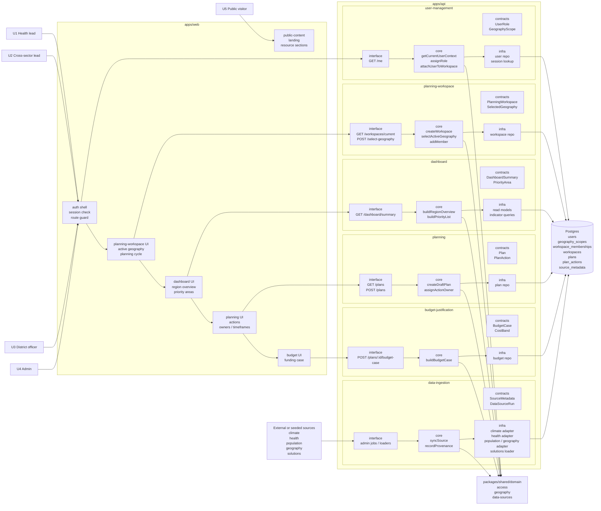
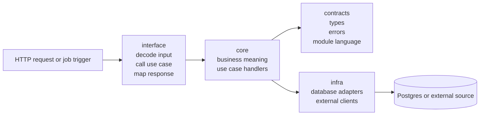
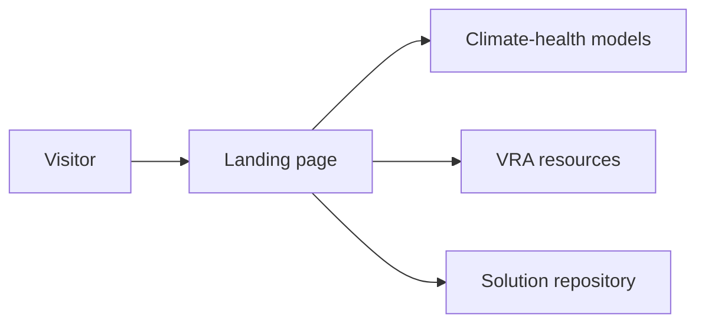
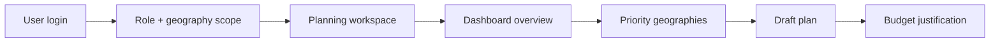

# CHART High-Level Module Design

## Goal

Define the first backend and frontend boxes for Sprint 3 and show how they connect.

The first usable flow is:

`U1 / U2 -> planning workspace -> dashboard -> plan -> budget justification`

## Main modules

| Module | Purpose | Main users |
| --- | --- | --- |
| `public-content` | public landing page and open resources | `U5` |
| `user-management` | users, roles, and geography scope | `U1`, `U2`, `U3`, `U4` |
| `planning-workspace` | shared context for a plan cycle and active geography | `U1`, `U2` |
| `dashboard` | region overview, indicators, priority geography view | `U1`, `U2` |
| `planning` | draft plan, actions, owners, timeframes | `U1`, `U2` |
| `budget-justification` | funding case from the draft plan | `U1`, `U2` |
| `data-ingestion` | climate, health, population, geography, and solutions inputs | system |

## Composable system view



## Module shape

Every backend module should be composable in the same way:



## Module inventory

| Module | What is inside it | Depends on |
| --- | --- | --- |
| `public-content` | landing page, public resources, public vs login split | no backend required first |
| `user-management` | user role, geography scope, workspace membership lookup | `packages/shared`, `Postgres` |
| `planning-workspace` | active geography, planning cycle, workspace members | `user-management`, `packages/shared`, `Postgres` |
| `dashboard` | summary view, indicators, priority list | `planning-workspace`, `data-ingestion`, `Postgres` |
| `planning` | draft plan, actions, owners, timeframes | `planning-workspace`, `dashboard`, `Postgres` |
| `budget-justification` | funding case, cost bands, export-ready output | `planning`, `Postgres` |
| `data-ingestion` | source adapters, provenance, sync jobs | external or seeded sources, `Postgres` |

## Responsibility flow

### 1. Public content
- explains CHART
- exposes public resources
- stays outside login

### 2. User management
- resolves who the user is
- resolves their role
- resolves their geography scope
- determines if they can enter a planning workspace

### 3. Planning workspace
- sets the active planning context
- stores selected geography
- stores workspace membership
- anchors later dashboard and planning actions

### 4. Dashboard
- shows the geography in scope
- surfaces climate, health, and population indicators
- helps identify priority geographies

### 5. Planning
- creates a draft plan
- adds actions
- assigns owners and timeframes

### 6. Budget justification
- transforms the plan into a funding case
- adds simple cost or effort framing

### 7. Data ingestion
- loads or syncs source data
- records source metadata
- makes data available to the app database

## Database-centered view

```mermaid
flowchart TB
    Database[("Postgres")]

    Users["users"]
    Roles["workspace_memberships"]
    Geographies["geography_scopes"]
    Workspaces["planning_workspaces"]
    Plans["plans"]
    Actions["plan_actions"]
    Sources["source_metadata"]

    Database --- Users
    Database --- Roles
    Database --- Geographies
    Database --- Workspaces
    Database --- Plans
    Database --- Actions
    Database --- Sources

    UserManagementUse["user-management"] --> Users
    UserManagementUse --> Roles
    UserManagementUse --> Geographies

    WorkspaceUse["planning-workspace"] --> Workspaces
    WorkspaceUse --> Roles
    WorkspaceUse --> Geographies

    DashboardUse["dashboard"] --> Geographies
    DashboardUse --> Sources

    PlanningUse["planning"] --> Plans
    PlanningUse --> Actions
    PlanningUse --> Workspaces

    BudgetUse["budget-justification"] --> Plans
    BudgetUse --> Actions

    IngestionUse["data-ingestion"] --> Sources
    IngestionUse --> Geographies
```



## Module connections

### Public path



### Logged-in path



## Suggested implementation order

| Order | Module | Why first |
| --- | --- | --- |
| 1 | `user-management` | everything else depends on role and geography scope |
| 2 | `planning-workspace` | gives `U1` and `U2` a shared context |
| 3 | `dashboard` | first real read model for users |
| 4 | `planning` | turns read model into action |
| 5 | `budget-justification` | completes the Sprint 3 value |
| 6 | `data-ingestion` | can start mocked, then become real connectors |

## First data decisions

For each source, decide one of:

- `sync into Postgres`
- `fetch from external endpoint`
- `seed locally for Sprint 3`

Current likely approach for Sprint 3:

| Source | First approach |
| --- | --- |
| climate | seed or sync |
| health | seed or sync |
| population | seed or sync |
| geography | seed or sync |
| solutions | local seed data |

## Module structure pattern

Use the same shape for each backend module:

```txt
module/
  contracts/
  core/
  infra/
  interface/
```

## First contracts to define

### `user-management`
- `UserId`
- `UserRole`
- `GeographyScope`
- `WorkspaceMembership`

### `planning-workspace`
- `PlanningWorkspace`
- `WorkspaceMember`
- `SelectedGeography`
- `PlanningCycle`

## Final takeaway

At a high level, CHART should be built as:

- public content in front
- scoped user access behind login
- one shared planning workspace for `U1` and `U2`
- dashboard feeding planning
- planning feeding budget justification
- all of it backed by a small set of source pipelines and Postgres
