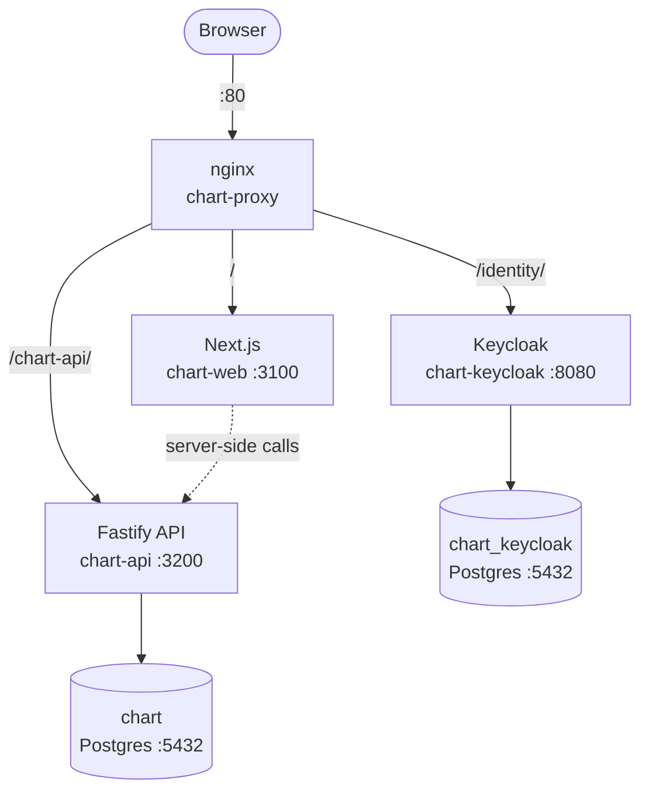

# Architecture

## Stack

| Layer    | Tech             | Port (internal) |
| -------- | ---------------- | --------------- |
| Web      | Next.js 15       | 3100            |
| API      | Fastify          | 3200            |
| Identity | Keycloak 26      | 8080            |
| Database | Postgres 16 (×2) | 5432            |
| Proxy    | nginx            | **80 (public)** |

## Container layout

All containers share a Docker bridge network (`chart-net`). Only nginx binds a public port.

## CI / CD

1. Push to `dev` triggers the `App Deploy` workflow.
2. GitHub Actions validates (typecheck, tests, builds both images).
3. On success, SSHes into EC2 and runs `infra/aws/deploy-app.sh`.
4. The script builds Docker images on the host and restarts all containers.

## Notes

- Keycloak runs in `start-dev` mode — cold starts are slow (~30 s). This is expected.
- Secrets (DB password, Keycloak admin password) are auto-generated on first deploy and persisted in `/opt/chart-env/chart.env`.
- The solution repository is loaded from `CHART_REPOSITORY_URL` if set; otherwise the bundled snapshot in `api/src/services/chart-repository/seed-data/seed.json` is used.
- App tables (`chart` DB) are owned by Drizzle. Keycloak tables (`chart_keycloak` DB) are owned by Keycloak. Keep them separate.
