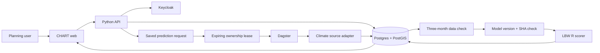

# Architecture

## Running services

| Service | Job | Local port |
|---|---|---:|
| Next (`new_design`) | connected planning interface | 3200 |
| FastAPI | all CHART API routes | 3210 |
| Dagster | fetch data and run prediction jobs | 3002 |
| R scorer | deterministic LBW calculation | 8000 |
| Keycloak | login, role, and place access | 8080 |
| Postgres + PostGIS | application and analytical data | 5434 |

Fastify is retired from the runtime. The planning interface forwards browser
credentials to FastAPI but owns no application rules or tables.

```mermaid
flowchart LR
  user["Planning user"] --> web["CHART web"]
  web --> api["Python API"]
  api --> keycloak["Keycloak"]
  api --> postgres[("Postgres + PostGIS")]
  api --> request["Saved prediction request"]
  request --> lease["Expiring ownership lease"]
  lease --> dagster["Dagster"]
  dagster --> climate["Climate source adapter"]
  climate --> postgres
  postgres --> gate["Three-month data check"]
  gate --> digest["Model version + SHA check"]
  digest --> scorer["LBW R scorer"]
  scorer --> postgres
  postgres --> web
```

The same Python image runs the API and supplies the code imported by Dagster.
EC2 deployment runs Alembic, loads the versioned place mappings, registers the
model release, and then starts the services.

Postgres is the durable queue and ownership authority. Prediction workers and
climate acquisitions use expiring leases; all commits verify ownership.
Model activation is scoped to an analytical area, module, and outcome. Climate
runs retain immutable source snapshots even if catalog metadata changes later.

The public solution repository is read through `CHART_REPOSITORY_URL`. The
bundled snapshot is only a local fallback.
