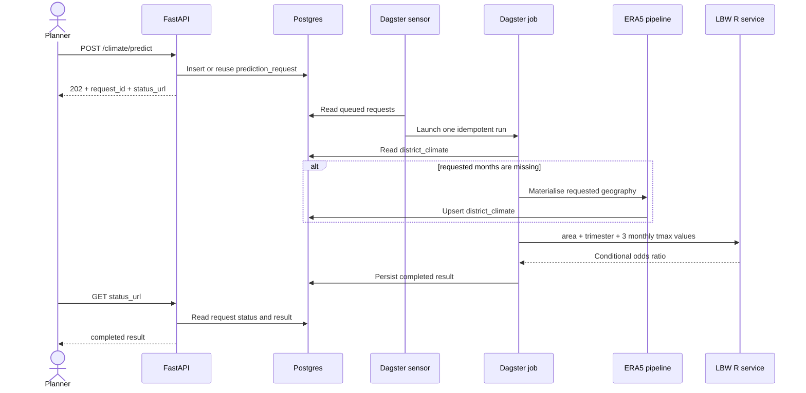
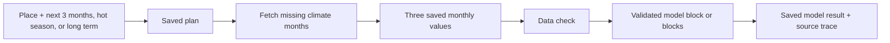

# Data pipeline

The user chooses a place and a simple planning option. CHART resolves the exact
three months. Dagster then saves the data before any model call.

## How the API and Dagster are coupled

The API and Dagster do not call each other directly. Postgres is their durable
handoff: the API writes a request, the Dagster sensor claims it, and the API
polls the same row for progress and results.



Dagster owns execution, retries, logs, and run history. FastAPI owns request
validation and HTTP responses. Postgres owns durable state. Redis is not part
of this path.

## Climate and model handoff



The shared climate record requires the place, month, Celsius value, source,
issue and valid dates, quality, freshness, area calculation version, raw file,
and hash. The saved model input always has exactly three consecutive months in
newest-to-oldest order.

Mixed windows are normal: a July planning request can use a C3S forecast for
July and ERA5 history for May and June. The dashboard labels each row as a
forecast or historical input. Live runs replace sample or stale rows before the
model call, fetch only the exact required ERA5 months, and reject incomplete
calendar months.

Sources currently supported in code:

- ERA5 for past/reanalysis work and historical charts;
- official C3S seasonal monthly data for the future planning window;
- ISIMIP3b bias-adjusted projections for the MP March–May 2031–2040 scenario
  slice; the user must choose SSP1-2.6, SSP3-7.0, or SSP5-8.5;
- fixtures for tests only.

Near-term ECMWF AWS remains unavailable until its complete-month checks are
implemented. Long-term values are scenario averages, never labelled forecasts.

Run and inspect:

```bash
make migrate
make dagster-run
make climate-api
PRESET=madhya-pradesh make climate-materialize
make dev                  # Dagster UI — http://127.0.0.1:3002
```

The dashboard shows the request ID, Dagster run ID, each monthly value and
source, model release, only the place's validated model results, and any warning. A
next-hot-season plan waits in Postgres and is queued automatically when C3S can
cover the season.

`PRESET` selects a geography partition (`madhya-pradesh`, `kajiado`, …). Materialisation
writes wide CSVs under `data/` and, when `DATABASE_URL` is set, loads **long-format**
rows into `district_climate`.

## Row shape

Postgres stores one row per admin unit × month × variable × climate run. A 60-month
window with three variables (`tmax`, `tmin`, `precip`) yields 180 rows — not 60 wide
columns. See `core/README.md` for the rationale.

## Orchestration package

Dagster definitions live in `orchestration/src/chart_pipeline/`:

- `definitions.py` — climate asset, monthly schedule, and on-demand prediction sensor/job

Full operator notes: [orchestration/README.md](https://github.com/CHART-Scope/CHART/blob/dev/orchestration/README.md)
in the repository.

## Handoff to the Python API

After materialisation, the climate predict API reads `district_climate` for preview and
LBW prediction. A preview still returns a manual `pull_hint`. Every new LBW outcome request
returns `202 Accepted`, persists an idempotent `prediction_request`, and is picked up by
`pending_prediction_requests_sensor`. Its Dagster run skips ERA5 when the required months
already exist and materialises only the requested geography when they are missing.

See [Modeling](modeling.md) for the scorer's inputs, artifact provenance, and
interpretation limits.

## What the dashboard queues on its own

The spatial risk map draws every administrative area beneath the selected
geography, so on a country with many areas most of them have no result the
first time anyone looks. Rather than leaving a map of blanks, a visit queues a
small number of the missing ones.

**Three areas per visit.** The cap is deliberate and it is the whole design.
Climate is fetched per area bounding box, and a month that is not already
cached takes minutes against the Copernicus Climate Data Store. Queueing a
whole country on page load would start one download per area — 47 for Kenya —
because somebody opened a page, and would do it again for the next month they
looked at. Three per visit fills a map in over a few visits while keeping page
load cheap and predictable, and it scales to countries with far more areas
without changing behaviour.

The constant lives in one place, `AUTO_PREPARE_PER_VISIT` in
`web/src/features/dashboard/SpatialRiskMap.tsx`.

**Automatic never replaces explicit.** A *Prepare remaining N* action sits on
the map for anyone with a planning role, and queues every runnable area at
once. The automatic allowance exists so a map is not empty on arrival, not to
ration what a planner can ask for.

Three rules keep this from misbehaving:

- **Only genuinely runnable areas.** An area is queued only when it has an
  active model for the selected outcome, has no stored result, and has no run
  already in flight. Areas with no fitted model are never queued — there is
  nothing to run.
- **Never twice in a session.** Queued geography ids are remembered for the
  life of the page. Without that, a run that failed would return to "not
  calculated", be picked up on the next render, and loop.
- **Role-gated, like every other run.** The same planning roles that may
  prepare a month from the risk card may trigger this; a read-only viewer
  queues nothing, automatically or otherwise.

### What the map's four states mean

| State | Meaning |
|---|---|
| Shaded amber → red | A stored result for this area, outcome and month |
| Loading data | A run is in flight — queued, fetching observations, or scoring |
| Not calculated yet | Runnable, but nobody has asked for it |
| Not integrated | No model has been fitted for this area |

"Loading data" is read from live `prediction_request` rows rather than assumed
from what the browser just submitted, so a run started by a colleague shows as
loading here too. The last two are kept distinct because they need different
things: one is a selection away, the other needs a fitted model from the
modelling team.

Areas in every state are always drawn. An area omitted from a map reads as
though it carries no risk, which is the opposite of what an absent model means.
