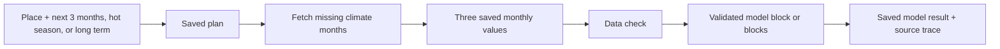

# Data pipeline

The user chooses a place and a simple planning option. CHART resolves the exact
three months. Dagster then saves the data before any model call.



The shared climate record requires the place, month, Celsius value, source,
issue and valid dates, quality, freshness, area calculation version, raw file,
and hash. The saved model input always has exactly three consecutive months in
newest-to-oldest order.

Mixed windows are normal: a July planning request can use a C3S forecast for
July and ERA5 history for May and June. The dashboard labels each row as a
forecast or historical input. Live runs replace sample or stale rows before the
model call, fetch only the exact required ERA5 months, and reject incomplete
calendar months.

Sources currently supported in code:

- ERA5 for past/reanalysis work and historical charts;
- official C3S seasonal monthly data for the future planning window;
- ISIMIP3b bias-adjusted projections for the MP March–May 2031–2040 scenario
  slice; the user must choose SSP1-2.6, SSP3-7.0, or SSP5-8.5;
- fixtures for tests only.

Near-term ECMWF AWS remains unavailable until its complete-month checks are
implemented. Long-term values are scenario averages, never labelled forecasts.

Run and inspect:

```bash
make migrate
make dagster-run
make climate-api
PRESET=madhya-pradesh make climate-materialize
make dev                  # Dagster UI — http://127.0.0.1:3002
```

The dashboard shows the request ID, Dagster run ID, each monthly value and
source, model release, only the place's validated model results, and any warning. A
next-hot-season plan waits in Postgres and is queued automatically when C3S can
cover the season.

`PRESET` selects a geography partition (`madhya-pradesh`, `kajiado`, …). Materialisation
writes wide CSVs under `data/` and, when `DATABASE_URL` is set, loads **long-format**
rows into `district_climate`.

## Row shape

Postgres stores one row per admin unit × month × variable × climate run. A 60-month
window with three variables (`tmax`, `tmin`, `precip`) yields 180 rows — not 60 wide
columns. See `backend/README.md` for the rationale.

## Orchestration package

Dagster definitions live in `orchestration/src/chart_pipeline/`:

- `definitions.py` — climate asset, monthly schedule, and on-demand prediction sensor/job

Full operator notes: [orchestration/README.md](https://github.com/CHART-Scope/CHART/blob/dev/orchestration/README.md)
in the repository.

## Handoff to the Python API

After materialisation, the climate predict API reads `district_climate` for preview and
LBW prediction. A preview still returns a manual `pull_hint`. Every new LBW outcome request
returns `202 Accepted`, persists an idempotent `prediction_request`, and is picked up by
`pending_prediction_requests_sensor`. Its Dagster run skips ERA5 when the required months
already exist and materialises only the requested geography when they are missing.

See [Modeling](modeling.md) for the scorer's inputs, artifact provenance, and
interpretation limits.
