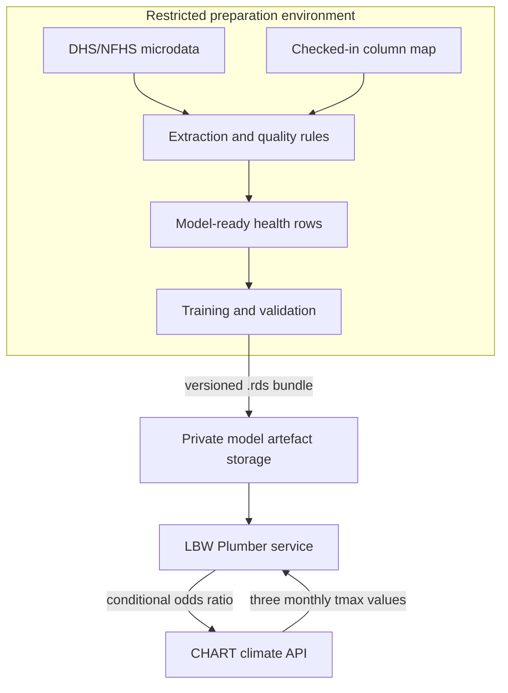

# NFHS/DHS health input contract

This document defines the boundary between restricted survey exploration,
health-model preparation, and CHART runtime inference. It is a schema and
governance contract, not an ingestion implementation.

Related artifacts:

- [Health survey exploration guide](health-survey-exploration-guide.md)
- `docs/health-survey-column-map.csv`
- [Climate API](climate-api.md)

## Scope

The first health-model path:

- uses approved NFHS-5 India or Kenya DHS source files outside Git;
- derives a documented low-birth-weight modeling dataset;
- joins health timing and geography to climate exposure;
- packages a reviewed, versioned model artefact;
- exposes inference through the internal LBW service and CHART Climate API.

Raw respondent records, survey downloads, and private model artefacts are not
part of the application repository.

## Data and model handoff



## Source assumptions

| Source | Intended use | Access and storage rule |
| --- | --- | --- |
| NFHS-5 / India DHS 2019–21 | India birth outcomes and maternal covariates | Requires approved access; raw files stay outside Git |
| Kenya DHS 2022 | Kenya birth outcomes and maternal covariates | Requires approved access; raw files stay outside Git |
| DHS/NFHS GPS cluster files | Climate exposure join | Restricted and privacy-displaced; document the join limitation |
| Recode dictionaries | Field definitions and missing-value codes | Safe to cite; do not reproduce licensed source data |

NFHS-6 is outside the current implementation contract until its access and
microdata status are confirmed.

Useful source links:

- [Kenya DHS 2022 dataset](https://dhsprogram.com/data/dataset/Kenya_Standard-DHS_2022.cfm?flag=0)
- [India DHS/NFHS-5 dataset](https://dhsprogram.com/data/dataset/India_Standard-DHS_2020.cfm?flag=0)
- [DHS data access portal](https://dhsprogram.com/data/)

## Data handling rules

- Store restricted source data under approved external storage or an ignored
  local path such as `data/restricted/health-surveys/`.
- Never commit raw survey, GPS, or respondent-level extracts.
- Commit only schemas, column maps, code, synthetic fixtures, and safe
  aggregate summaries.
- Record dataset version, extraction version, model version, and quality checks
  for every model release.
- Keep model artefacts in private artefact storage and load them by explicit
  version.

## First outcome

The implemented outcome is **low birth weight**, represented as:

- outcome: `low_birth_weight`;
- source measure: measured or reported birth weight in grams;
- threshold: `< 2500g` after applying the agreed validity filters;
- record family: DHS/NFHS birth or child record;
- exposure input: three monthly maximum-temperature means selected by
  trimester and area.

Neonatal or infant mortality is a possible later extension, not part of the
current runtime contract.

## Model-preparation schema

The extraction should produce a stable schema before model fitting:

```txt
country
survey_id
survey_year
record_id
cluster_id
admin1
admin2
birth_month
birth_year
birth_cmc
outcome_name
outcome_value
birth_weight_g
sample_weight
maternal_covariates...
climate_join_key
data_status
source_file_family
quality_flags
```

The checked-in column map records the exact source variable for each field and
whether that mapping is confirmed, conditional, or blocked.

## Decisions required before a new model release

The model owner and data steward must confirm:

1. the outcome and eligible survey population;
2. exact BR, KR, IR, GE, or other input files;
3. source columns and special-value filters;
4. sample-weight, PSU, and strata handling;
5. GPS-cluster, administrative-area, or survey-region climate join;
6. pregnancy and trimester exposure windows;
7. validation metrics and release acceptance criteria;
8. runtime model identifier and artefact checksum.

These are contract decisions. Public documentation should describe the role
and evidence required, not depend on named individuals.

## Runtime API contract

The deployed inference path receives model inputs derived from `district_climate`;
it never receives respondent-level survey rows. The public CHART request
contains `location_slug`, `timeframe_id`, and an LBW outcome configuration.
The Python API validates the request, Dagster prepares missing climate data,
and the internal R service scores the versioned model bundle.
