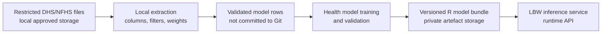
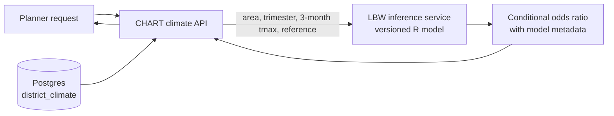

# NFHS/DHS health survey exploration guide

This guide explains where restricted DHS/NFHS survey data fits into CHART,
what the health model needs, and which outputs are safe to share. Raw
respondent records are model-development inputs; they are not sent to the
runtime CHART API.

## Where survey data fits



The checked-in column map documents the extraction contract. It does not grant
access to the underlying survey files and must not contain respondent values.

## Exploration sequence

1. Confirm approved datasets, access rights, and local storage.
2. Confirm the model contract: outcome, source columns, filters, survey
   weights, geography join, exposure window, and output shape.
3. Update `docs/health-survey-column-map.csv` with exact source fields and
   unresolved decisions.
4. Validate the derived schema without publishing respondent-level data.
5. Package the fitted model as a versioned artefact for the runtime inference
   service.

## Files to inspect after approved access

| File family | Why it matters | Exploration output |
| --- | --- | --- |
| BR or KR birth/child record | Birth date, birth weight, child sex, survival/death fields | Exact outcome and timing columns |
| IR individual/women record | Maternal covariates and survey design fields | Required joins and covariates |
| GE GPS cluster file | Cluster or region metadata for climate exposure joins | Join level and privacy-displacement caveat |
| Recode dictionary / variable labels | Field meanings and special missing codes | Exclusion and quality rules |

## First-pass checklist

- Record dataset name, country, survey years, file family, and format.
- List columns and labels for birth date, birth weight, survival, age at death,
  cluster, region, sample weight, PSU, strata, and the climate join.
- Count rows and missingness for candidate outcome fields.
- Identify special values for missing, not weighed, refused, or implausible
  birth weights.
- Confirm whether model preparation uses individual birth rows or aggregated
  geography-month rows.
- Confirm whether climate exposure joins at GPS cluster, administrative area,
  or survey region.
- Do not copy raw records into GitHub, documentation, screenshots, or fixtures.

## Current model assumption

The current runtime model estimates the temperature association with **low
birth weight**. The working derived field is:

```txt
low_birth_weight = birth_weight_g < 2500
```

That definition is incomplete until the model contract also specifies special
and missing-value filters, survey design handling, and the pregnancy or
trimester exposure window.

## Runtime boundary

Survey microdata is used before deployment to produce the versioned model
bundle. At runtime, CHART sends three monthly maximum-temperature values,
geography, trimester, and reference temperature to the LBW inference service.
The service returns a conditional odds ratio; it does not calculate an
individual baby's probability of low birth weight.



## Safe outputs from exploration

Safe to commit:

- column names and labels;
- field availability and missingness summaries;
- extraction contracts and pseudocode;
- aggregate validation summaries;
- small synthetic examples that do not come from respondent records.

Do not commit:

- raw `.DTA`, `.SAV`, `.DAT`, `.ZIP`, or GPS files;
- respondent-level CSV exports;
- screenshots showing real respondent rows;
- exact displaced GPS points unless access and data-rights rules allow them;
- fitted model artefacts that are licensed or classified for private storage.
