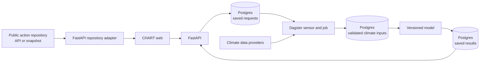

# CHART documentation

CHART uses one Python API, Dagster for background data work, Keycloak for
access, Postgres/PostGIS for saved data and results, and the canonical Next web
app for the browser experience.

This site explains how to run the platform locally and operate its application,
model, and climate data pipeline.

CHART is developed as open-source infrastructure under the
[GNU Affero General Public License v3.0](licensing.md). The project is designed
for inspection, local adaptation, and independent deployment while supporting
digital-public-good principles.

## Start here

Follow [Getting started](getting-started.md) to install CHART, start the complete
local environment, and verify that it is working.

!!! note "Local and published addresses"
    This documentation site is public. Addresses beginning with `127.0.0.1`
    refer to services on your own computer and only work after you start CHART
    locally.

## Runtime

CHART has one Python backend (`backend/chart/`):

- **FastAPI** for synchronous app and engine endpoints
- **Dagster** for batch climate ingestion and model handoffs
- **SQLAlchemy + Alembic** as the sole schema owner

The retired Fastify/Drizzle API is not installed, started, or deployed.

## How the pieces connect

Dagster does not own application requests or user-facing API routes. FastAPI
saves durable work in Postgres, and Dagster claims that work, prepares the
required climate inputs, and hands validated inputs to the model. The public
action repository remains a separate publishing service that CHART reads over
HTTP.

## Read next

| Page | Use it for |
|---|---|
| [Getting started](getting-started.md) | Install and run CHART locally |
| [Installation setup](installation-setup.md) | Complete the first-run onboarding wizard, reset an installation, or recover from a stuck bootstrap |
| [Python backend overview](python-backend.md) | Build FastAPI modules |
| [Modeling](modeling.md) | Understand the LBW model, inputs, outputs, and limitations |
| [Climate API](climate-api.md) | Understand preview and prediction parameters |
| [API explorer](api-reference.md) | Browse the published API contracts |
| [Data pipeline](data-pipeline.md) | Run Dagster assets and materialisation |
| [Add a geography and model](add-geography-and-model.md) | Extend the supported analytical areas |
| [Where model updates happen](model-updates.md) | Register, version, or replace a health model — for CHART devs and external adopters |
| [Health survey exploration](health-survey-exploration-guide.md) | Survey-to-model flow and safe outputs |
| [Health input contract](health-input-contract.md) | Model-preparation schema and runtime boundary |
| [Digital public good and licensing](licensing.md) | Understand CHART's AGPL licence, source availability, and third-party boundaries |
