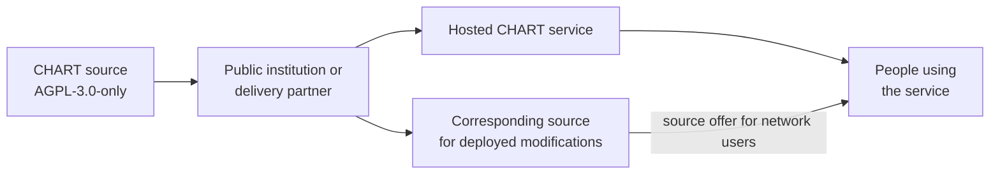

# Digital public good and licensing

CHART is developed as open-source infrastructure for public-interest climate
and health planning. The project is designed to be inspectable, reusable,
adaptable, and independently deployable by public institutions and their
partners.

This describes the project's digital-public-good intent. It does not claim
that CHART is currently certified or listed by the Digital Public Goods
Alliance.

## Software licence

CHART's project-authored software and documentation are licensed under the
**GNU Affero General Public License, version 3.0** (`AGPL-3.0-only`).

- The complete legal text is in the repository's
  [`LICENSE`](https://github.com/CHART-Scope/CHART/blob/dev/LICENSE) file.
- Project copyright, dependency, and content notices are in
  [`NOTICE`](https://github.com/CHART-Scope/CHART/blob/dev/NOTICE).
- The canonical licence text is also available from the
  [Free Software Foundation](https://www.gnu.org/licenses/agpl-3.0.html).

The AGPL permits people and organisations to run, study, modify, and
redistribute CHART under its terms. Its network-use provision requires an
operator that offers a modified CHART service over a network to offer the
corresponding source of that modified version to the users interacting with
it. Operators must also preserve applicable copyright and licence notices.

The `LICENSE` file is authoritative. This page is a practical summary, not
legal advice.

## Why AGPL

CHART is a web platform intended for shared and hosted deployments. AGPL
network copyleft helps ensure that improvements to hosted forks remain
available to the institutions and communities using them, rather than only to
the hosting provider.

## Digital-public-good principles

The repository aims to support:

- **independent deployment** without dependence on one hosting provider;
- **open interfaces** through documented HTTP and OpenAPI contracts;
- **transparent models and provenance** appropriate to the rights governing
  each model and dataset;
- **privacy-aware data handling**, particularly for restricted health survey
  and displaced geospatial data;
- **local adaptation** by public institutions and implementation partners;
- **shared improvements** through an open contribution and review process.

## Data, models, and imported content

The repository licence does not erase separate rights attached to third-party
materials.

- Imported action-repository records, media, case studies, and snapshots may
  have their own source, attribution, and licence metadata.
- Restricted DHS/NFHS respondent data is not distributed with CHART.
- Model artefacts may be stored privately when their source data, contributor
  terms, or release status require it.
- Dependency packages retain their own licences.

Do not remove or obscure those notices. Confirm that a dataset, model, image,
or document can be redistributed before including it in a public deployment
or derivative repository.

## Deployment checklist

Before operating or redistributing a modified CHART deployment:

1. retain the `LICENSE` and `NOTICE` files;
2. record the deployed source revision and local modifications;
3. provide network users with a clear link or written offer for the
   corresponding source when AGPL requires it;
4. preserve third-party attribution and licence metadata;
5. keep restricted data and non-public model artefacts outside the public
   source repository;
6. publish any additional operational or data-use terms separately without
   restricting rights granted by AGPL.

Questions about a specific deployment or redistribution should be reviewed by
the organisation responsible for that deployment.
