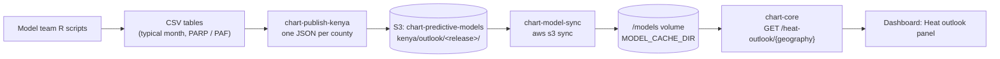

# From R output to the dashboard

This page explains how a model team's results reach the CHART dashboard
without CHART running the model. The Kenya low birth weight (LBW) heat model
and the under-five mortality temperature model use this path. The modelling
team's R scripts compute everything, and CHART only filters and displays the
tables.



There is no database table, Dagster job or R process on this path. A county
either has a published file or the API returns `404 OUTLOOK_NOT_PUBLISHED`.

## How `chart-model-sync` works

`chart-model-sync` is a one-shot container in
`infra/aws/docker-compose.yml`. It runs the official AWS CLI image and copies
the model bucket onto a shared Docker volume:

```sh
aws s3 sync "s3://$MODEL_BUCKET/" /models/ --exclude "archive/*" [--no-sign-request]
```

| Setting | Default | Meaning |
| --- | --- | --- |
| `MODEL_BUCKET` | `chart-predictive-models` | Bucket mirrored onto the volume. |
| `MODEL_BUCKET_PUBLIC` | `1` | `1` reads anonymously (`--no-sign-request`). `0` signs with the EC2 instance role, which needs `s3:ListBucket` and `s3:GetObject`. |
| `AWS_REGION` | `eu-west-2` | Region of the bucket. |

- **What it copies.** The whole bucket except `archive/`. Both the `.rds`
  artifacts used by the live scorer and the outlook JSON files arrive this
  way.
- **Where it lands.** The `chart-lbw-model` volume is mounted at `/models` in
  both `chart-lbw` (the R scorer) and `chart-core` (the API). Both containers
  set `MODEL_CACHE_DIR=/models`.
- **When it runs.** Whenever the stack is brought up. `chart-lbw` waits for it
  to finish successfully (`service_completed_successfully`), and `chart-core`
  starts after `chart-lbw` through the bootstrap step. A deployment therefore
  never serves files older than the bucket at deploy time.
- **Idempotency.** `aws s3 sync` copies only new or changed objects, so
  re-running it is cheap and safe.
- **Updating without a deploy.** Run the container again with
  `docker compose run --rm chart-model-sync`. The API reads each file's
  modification time and picks up new content without a restart.

Locally, there is no sync. `MODEL_CACHE_DIR` defaults to `pipelines/models/`,
and `chart-publish-kenya` writes there by default, so the layout matches the
bucket. `pipelines/models/kenya/` is git-ignored.

## Bucket layout for the outlook

```text
s3://chart-predictive-models/kenya/outlook/<release>/
  lbw/<county>.json                 46 counties
  lbw/kenya.json                    national period summary
  under_5_mortality/<county>.json
  under_5_mortality/kenya.json
```

`<release>` is the modeller's version label, for example `v2_2026_10_06`. The
API reads the release named by `CHART_KENYA_OUTLOOK_RELEASE`, which defaults to
the current one in `chart/heat_outlook/service.py`. Publishing a new release
never overwrites an old one, and switching back is one environment variable.

County file names are the county name in lower case, with apostrophes removed
and other punctuation turned into hyphens (`Murang'a` → `muranga`,
`Taita Taveta` → `taita-taveta`). They match the `geo-ke-<county>` geography
IDs.

## Publishing a new release

1. Receive the model team's `model_files/` folders for LBW and under-five
   mortality.
2. Run the publish script. It reads the CSVs, reshapes them and writes the
   JSON files:

    ```sh
    chart-publish-kenya \
      --lbw-dir path/to/LBW_.../model_files \
      --u5-dir path/to/U5_.../model_files \
      --release v2_2026_10_06
    ```

3. Check the dashboard locally against the developer guides' tables. For
   example, check the national whole-pregnancy PARP for 2041–2060 under
   SSP5-8.5.
4. Upload with `--upload`, which runs
   `aws s3 sync <out> s3://chart-predictive-models/kenya/outlook/<release>/`.
   This needs write credentials for the bucket.
5. If the release label changed, set `CHART_KENYA_OUTLOOK_RELEASE` and
   redeploy, or rerun `chart-model-sync`.

The script uses only these input files:

| Outcome | Files |
| --- | --- |
| LBW | `lbw_tmax_dlnm_national_no_altitude.json`, `typical_month_heat_LBW_dlnm_county.csv`, `PARP_heat_dlnm_county_by_period.csv`, `PARP_heat_dlnm_national_by_period.csv`, `exposure_response_curves_by_window.csv` |
| Under-five | `u5_tmax_dlnm_models.json`, `typical_month_u5_county.csv`, `PAF_u5_county_by_period.csv`, `PAF_u5_national_by_period.csv` |

## What the dashboard shows

On Kenyan places the dashboard's risk panel reads the published tables; there
is no month picker and nothing is prepared or polled. Planning for Kenya opens
on Kenya as a whole, and the reader picks a county on the map or in the
context bar.

The headline figure is the **annual-average share** for the chosen period and
scenario (the modeller's PARP for LBW, PAF for under-five), because only the
period summaries carry a 95% CI:

| Element | Source |
| --- | --- |
| Icon array | The share, rounded, as filled figures out of 100 |
| Sentence | Share with its 95% CI, period, place |
| Change | Change from the baseline in points, with its 95% CI |
| Ratio | Odds ratio (LBW) or risk ratio (under-five) with 95% CI, converted from the share and its bounds (below) |
| Precision badge | The ratio's CI, on the health team's thresholds (high ≤ 2.5, moderate ≤ 5, low above) |
| Map | Every county shaded by the same share; `GET /heat-outlook/{geography}/map` |
| Seasonal pattern | Typical month by calendar month (ensemble mean and range), and all periods |

Controls: **pregnancy window** (LBW; whole pregnancy by default) or **age
group** (under-five; post-neonatal by default, as agreed with the modeller on
2026-10-08), **scenario** (default SSP5-8.5) and **period** (default
2041–2060). The baseline is always shown: 1981–2010 for LBW, 1991–2020 for
under-five.

**Ratio conversion.** Both guides define the share as AF = 1 − 1/RR. Under-five
is a case-crossover design, so the odds ratio is the risk ratio:
RR = 1 / (1 − AF). For LBW the guide converts OR to RR with Zhang–Yu and the
fitted LBW proportion p0 (published in each file), so
OR = RR (1 − p0) / (1 − p0 RR). The same transform is applied to both CI
bounds. Where it has no inverse (p0 RR ≥ 1) no ratio is shown.

The guides' display rules are applied in the API, so a suppressed value
arrives as `null` with the message to show in its place:

| Case | Shown instead of a share |
| --- | --- |
| LBW 3rd trimester, or any negative LBW share | "No excess heat risk estimated for this window (estimate below 1, compatible with no effect)." |
| Neonatal heat | "No heat-related excess in newborn deaths was found; risk was higher on cooler days." The ratio and its CI are still shown. |
| Other negative under-five shares | "No heat-related excess estimated" or "No excess on cooler-than-usual days" |
| Post-neonatal, infant, child, under-5 | Noted as "Approximate death dates." |
| More than 10% of months or days above the 99th percentile | "Estimate relies partly on temperatures rarely seen in the fitting data." |

On the map, a suppressed county is drawn near-white with its own legend entry,
**No heat excess**, so it is not read as low risk. A choice with no period
summary (the 3rd trimester) shows every county as "Not reported", and a county
with no published file as "Not integrated".

**3rd-trimester odds ratio by month.** The tables carry no per-county
odds ratio for the 3rd trimester. The seasonal pattern reads it from the
modeller's national T3 exposure-response curve at the hottest of the three
trimester months for that county, scenario and period: the worst case. Below
the minimum-risk temperature it is 1.

## Known gaps

- **Narok.** Narok county is not in the v2_2026_10_06 tables, so its page
  shows "No outlook has been published".
- **Sub-counties.** The constituency-level tables exist but are not
  published. CHART does not yet have the 290 constituency boundaries.
- **Counts.** There are no births or deaths counts, so only percentages are
  shown, never attributable numbers.

## Relation to the live scorer

The older path scores each month on request: Dagster calls the R scorer and
writes `prediction_result`. It still runs, and the panel above it on the
dashboard still uses it. The outlook does not depend on it. Retiring the live
path is a separate change.
