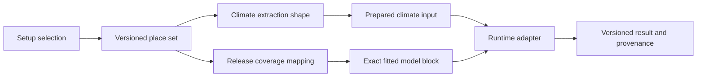

# Model source review and onboarding plan

This review uses the three model-team bundles supplied on 14 August 2026. It
records what CHART can safely deploy and the small architecture change needed
to make later model releases routine.

## Verified source packages

| Model | Fitted geography | Runtime input | Deployable coverage |
| --- | --- | --- | --- |
| Kenya low birth weight | Climate zone | Three monthly `tasmax` values, newest first | 46 counties mapped to five fitted zones |
| Madhya Pradesh low birth weight | One MP-wide window-1 fit and division fits | Three monthly `tasmax` values, newest first | MP state for window 1; ten divisions for windows 1–3 |
| Madhya Pradesh under-five mortality | Division | Four daily `tasmax` values, lag 0–3 | Ten divisions |

The LBW models are binomial DLNMs. Kenya and the MP divisions contain three
pregnancy-window fits; the separate MP-wide source contains only window 1. The
mortality model is a conditional-logistic case-crossover DLNM.
They may share artifact loading and numerical scoring, but they do **not** share
an input contract.

### Spatial evidence

- Kenya supplies 47 county shapes and a county-to-climate-zone attribute. Its
  fitted data contains six zones, but the fitting loop explicitly skips
  `North-western`; only Turkana maps there. Turkana must remain visible but not
  prediction-enabled until an approved fitted block exists.
- The MP LBW and mortality ZIPs contain byte-identical ten-division shape
  files. CHART should store and validate that place set once.
- The file named as an MP state shape contains 341 sub-district features. A
  state display shape must be a documented dissolve or another approved
  source, not an assumed single polygon.
- Both MP fitting scripts assign displaced DHS points with nearest-feature
  matching to a division. This method is model provenance; it is not the rule
  CHART uses to route a user's selected place.

## Findings to resolve before production activation

1. The Kenya source RDS repeats the South-eastern model block and the MP LBW
   source repeats Gwalior objects. Packaging accepts repeated runtime objects
   only when their values are identical and rejects conflicting fitted inputs.
2. MP LBW stores `n_training` from the pre-model analysis rows. Missing
   covariates mean this overstates the rows used by every division model. Use
   `nobs(model)`, as the Kenya packager already does, and publish a new release.
3. For under-five mortality, `model$n` is the number of case/control rows,
   while `model$nevent` is the number of deaths. Expose these as
   `n_model_rows`, `n_events`, and `n_subjects`; do not compare its count with an
   LBW participant count under one ambiguous label.
4. The MP LBW division source in the new ZIP exactly matches the reviewed
   source hash. CHART packages the four-object `Dlnlm_Objs.rds` state source
   directly and does not manufacture additional MP-wide windows.
5. Modelled temperature ranges come from each fitted basis's boundary knots.
   They are support metadata, not a manually chosen UI range. Golden cases
   must verify scoring at the reference, inside the range, and near both ends.

## Target package design

Keep user places independent from model releases:

```text
pipelines/places/ke-counties-v1/
  place-set.json

pipelines/places/in-mp-v1/
  place-set.json
  shapes.geojson

pipelines/models/<family>/<release>/
  release.json
  golden-cases.json
```

The Kenya place set reuses the existing normalized county GeoJSON rather than
copying it. The compact model artifact remains in immutable object storage. The
repository stores its checksum, not restricted respondent rows.



`place-set.json` owns stable place codes, labels, hierarchy, shape keys,
source, licence, and shape checksum. `release.json` references one place-set
version and owns only model identity, artifact hashes, input/output contracts,
presentation, and `place_code → model_area_name` coverage.

This removes country rules from setup and inference:

- setup lists the places supported by at least one enabled release;
- the UI renders the hierarchy and labels returned by the backend;
- the backend resolves the selected place through the release coverage map;
- unsupported places never fall back to a neighbouring model block;
- a model update cannot silently change names, shapes, or existing results.

## Non-breaking migration

1. Keep reading current version-1 manifests.
2. Add version-2 support for a `place_set` reference and `coverage` records.
3. Generate the two shared place sets from the already verified source shapes.
4. Publish new release IDs for corrected artifacts; never edit a registered
   release.
5. Switch setup and prediction resolution to the shared resolver, then remove
   the old family-specific geography loaders only after parity tests pass.

## CI and release gates

Every proposed release must pass, in order:

1. schema, stable IDs, hierarchy, and duplicate-key validation;
2. shape validity, source receipt, licence, and checksum validation;
3. coverage validation: every selectable place resolves to one real block;
4. artifact checksum and respondent-row exclusion checks;
5. source-to-compact metadata checks, including fitted row/event counts;
6. model-team golden scoring cases for every area and supported input profile;
7. setup, prediction, authorization, and rollback integration tests;
8. backend tests, orchestration tests, web typecheck/build, and format check.

Raw DHS and climate cubes stay outside normal CI. A controlled packaging job
starts from the modeller-approved fitted object, emits the compact artifact and
source receipt, and then opens the repository change containing only metadata,
checksums, place-set references, and golden cases.

## Next implementation round

Implemented locally as a new immutable review release:

- version-2 place-set references behind version-1 compatibility;
- shared, checksummed Kenya and MP place sets and valid MP state union;
- duplicate fitted-input validation and corrected MP LBW fitted-row counts;
- an explicit under-five `n_model_rows` field while retaining `n_training` as a
  compatibility alias;
- setup, hierarchy, shape, coverage, scorer, and score-parity tests.

The MP `1.0.1-compact-review` artifact contains exactly 31 fitted blocks: the
single supplied MP-wide window-1 fit and 30 direct division fits. Exact scoring
parity passed for every block, and the old CHART state-refit path is retired.
The release remains review-only until the model team confirms golden cases,
source licences, and production approval. Kenya North-western coverage also
remains a separate modeller decision.
