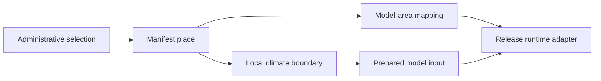

# Model releases

CHART installs model artifacts, administrative geography, and model-area
mapping from versioned `model-release*.json` files below `pipelines/models/`.
Onboarding and its dropdowns do not maintain a separate country list.

## What the manifest controls

| Section | Purpose |
| --- | --- |
| `schema_version` | Contract version. Existing embedded-geography releases are version `1`; new shared-place-set releases use version `2`. |
| Identity | Immutable release `id`, `version`, `module`, `outcome`, hazard, health domain, and source Git reference |
| `runtime` | Adapter and artifact type used to prepare the model |
| `input_contract` | Model-specific variables, units, shape, and ordering |
| `output_contract` | Effect measure, confidence level, and any derived-result policy |
| `presentation` | User-facing labels plus the dashboard visualization and figures used for this model |
| `model_files` | Artifact filenames and SHA-256 checksums |
| `geography` / `areas` | Version 1: embedded places and fitted mappings |
| `place_set` / `coverage` | Version 2: checksummed shared places plus fitted mappings owned by this release |

Administrative geography and model geography are deliberately separate.
Kenya declares 47 navigation and climate-extraction counties. The middle-layer
`areas` mapping connects 46 of them to five fitted climate-zone blocks.
Multiple counties can use the same block without the UI or inference code
knowing Kenya-specific rules. Turkana is declared in `geography.places` but
omitted from `areas`: it may be shown later as an unsupported catalog place,
but setup cannot select it because no North-western model exists.

## Manifest field reference

### Identity, runtime, and contracts

| Field | Meaning and rule |
| --- | --- |
| `schema_version` | Use `1` for existing embedded geography or `2` for a shared place set. |
| `id` | Globally unique immutable release identity. Changing content requires a new ID. |
| `version` | Model-team release version shown in provenance; it does not replace `id`. |
| `module` | CHART capability, currently `prediction` for these models. |
| `outcome` | Stable machine key such as `lbw` or `under_5_mortality`; never use display copy here. |
| `climate_hazard` | Stable hazard key such as `extreme_heat`. |
| `health_domain` | Stable health-domain taxonomy key. |
| `base_uri` | Versioned `s3://` prefix containing the immutable artifacts. |
| `runtime.adapter` | Registered backend adapter, such as `compact_r_registry`. Unknown adapters fail preparation. |
| `runtime.artifact_type` | Artifact packaging type, such as `rds`; it is not inferred from UI labels. |
| `input_contract` | Variables, units, interval, order, and dimensions accepted by the scorer. |
| `output_contract` | Effect measure, confidence level, and derived-output rules. |
| `presentation` | Human-readable copy and UI rendering metadata. These values must not be used for model routing. |
| `release_notes` | Scientific and operational limitations for this exact release. |
| `source_git_ref` | Immutable model-team source revision used to build the artifact. |

### Artifact fields

| Field | Meaning and rule |
| --- | --- |
| `model_files[].filename` | Basename below `base_uri`; paths and duplicate filenames are rejected. |
| `model_files[].sha256` | Lowercase 64-character digest checked before activation and by inference. |
| `areas[].model_file` | Must exactly match one declared filename. |

### Geography fields

New releases should use schema version 2. `place_set` pins the place-set ID,
version, repository path, and SHA-256. `coverage` maps supported place codes to
artifact blocks. The backend verifies the place-set file, shape file, hierarchy,
and coverage before setup can display or install the release. See
`pipelines/places/README.md` for the checked-in Kenya and MP place sets.

Version 1 remains supported for registered releases and carries the equivalent
information in `geography` and `areas`.

The top-level `geography` object declares:

- `country_code` and `country_name`;
- `root_id` and `root_path`;
- `analytics_slug`, which identifies the analytical geography in the backend;
- `boundary_artifact`, when the release installs local polygons;
- ordered `levels`. `key` is the stable application key, `label` is the exact
  UI label, and `sort_order` controls display order.

`geography.levels[]` is the single source of truth for administrative labels.
For example, India declares `geo_level_1` as `State`, while Kenya declares the
same generic level key as `County`. Setup does not translate or guess these
labels.

Each `geography.places[]` entry declares the user-facing hierarchy:

- `place_code`: stable analytical place code;
- `display_name` and globally stable `geography_id`;
- `app_level`, which must reference one `geography.levels[].key`;
- `level_label`, which must exactly equal that level's canonical label;
- `parent_place_code`, or null for a top-level administrative area;
- `path` and `sort_order` for navigation and dropdowns;
- `boundary_key`, matching `admin_unit_code` in the boundary GeoJSON.

Each `areas[]` entry then maps an eligible `place_code` to the exact
`model_area_name` expected inside `model_file`, plus any model-specific
validated options. Its `country_code` and administrative `level` must agree
with the corresponding place. `model_area_name` may be a different grain: for
example, Kajiado County maps to the `South-eastern` climate-zone block.
`presentation.model_scope_label` supplies the matching human-readable scope,
such as `climate-zone model`; it explains the mapping but never controls it.
`presentation.visualization.kind` selects a registered dashboard renderer.
The current releases use `odds_ratio_icon_array`; `figure` and
`context_figure` select manifest-approved pictograms. A new visualization kind
must be implemented and tested before that release is activated. Outcome names
must never be used in the browser to guess a chart or icon.

The schema rejects duplicate level keys or labels, duplicate place codes,
geography IDs, paths or boundary keys, unknown levels or parents, parent
cycles, country/level mismatches, and place labels that disagree with the
canonical level declaration.

## What onboarding includes

Setup derives its choices from all installed manifests using these rules:

1. A country appears only when at least one enabled release has a `geography`
   section and at least one fitted `areas` mapping.
2. A place is selectable only when its `place_code` appears in `areas` for at
   least one installed model release in that country.
3. An unsupported ancestor may be retained only as a hierarchy grouping needed
   to reach supported children; it cannot be submitted as the final choice.
4. Labels and level order come from `geography.levels`, not from hard-coded
   country logic in the browser.
5. Each selectable place includes `modelMappings` derived from installed
   releases: release, outcome, exact `model_area_name`, and model-scope label.
   Onboarding shows this beside the administrative choice so operators can
   verify, for example, `Kajiado County → South-eastern (climate-zone model)`.
6. The backend repeats the same checks when setup is submitted, so a caller
   cannot bypass the dropdown and install an unsupported place.

Consequently, the current India setup shows Madhya Pradesh—not every Indian
state—and its ten supported divisions. Kenya setup shows 46 supported counties.
Turkana remains a known navigation geography but is not an installation choice
until an approved North-western mapping is supplied.

The backend returns canonical `levels`, filtered `places`, a
`predictionSupported` flag, and manifest-derived `modelMappings` through
`GET /setup/options`. The browser builds Country → parent → child controls from
that response. Setup rejects a geography payload that differs from the
installed manifest or has no model mapping.

Launching the installation registers, verifies, and starts every enabled
release discovered under `pipelines/models/`, not only releases for the
administrator's selected country. Setup fails as one transaction if any
installed artifact is missing or invalid. A failed first-run attempt can be
retried with corrected wizard details; it does not require an authenticated
installation reset.

Changing the current working area is not an installation reset. Administrators
may switch among model-backed areas within their assigned installation country;
other users remain inside their explicitly assigned geography. Planning and
Dashboard list outcomes available at the selected place or below it. For
example, an MP state workspace lists both LBW and under-five mortality. LBW may
run at state or division level; under-five mortality automatically requires a
supported division because the release has no fitted state block.

## Add or update a model

1. Put the model implementation under `pipelines/models/<family>/`.
2. Upload the immutable artifact under a new versioned `base_uri` and calculate
   its SHA-256.
3. Add a new `model-release*.json`. Use the Kenya and MP review manifests as
   complete examples.
4. Add or reference a boundary artifact whose `admin_unit_code` values match
   the manifest `boundary_key` values.
5. Implement a runtime adapter if the declared adapter does not already exist.
6. Validate the manifest and artifact.
7. Run backend, onboarding, inference-parity, and web-build checks.

Discovery is recursive below `pipelines/models/`. Review releases appear only
when the generic `CHART_ENABLE_REVIEW_MODELS` gate is enabled.

## Runtime adapters

Setup dispatches artifact preparation through `runtime.adapter`. The current
compact R models use `compact_r_registry`. A future outcome can use a different
adapter and input contract without adding outcome-specific branches to
onboarding or geography loading.

An unsupported adapter fails preparation explicitly; CHART does not activate a
release it cannot verify and load.

## Updating an existing deployment

Never edit the identity or model mapping of a registered release. Publish a new
release ID and version, update artifact checksums, and activate that release.
Historical predictions retain their original release ID and input hash.

## Required checks

- Every selectable place has at least one model mapping and a complete, acyclic
  parent chain.
- Every place label exactly matches its declared canonical level label.
- Every boundary key resolves to exactly one polygon.
- Every artifact matches its SHA-256.
- Every area maps to a real model block.
- The runtime returns the requested release, version, file, and checksum.
- Existing model parity tests still pass.
- Role and geography authorization is enforced for prediction requests.

See [Add a geography and model](add-geography-and-model.md) for boundary and
mapping details, and [Modeling](modeling.md) for interpretation constraints.
