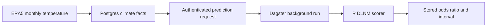

# Modeling

CHART's first implemented health model estimates the association between
monthly maximum temperature and low birth weight (LBW) in Madhya Pradesh,
India.

The current model is an **inference demo around already fitted R models**. It
does not train a new model, download climate data, forecast weather, or estimate
an individual baby's probability of low birth weight.

## Current modeling status

| Capability | Current status |
|---|---|
| Outcome | Low birth weight |
| Geography | Madhya Pradesh state and 10 administrative divisions |
| Exposure | Monthly mean of daily maximum 2 m temperature |
| Model family | Distributed Lag Non-linear Model (DLNM) terms in logistic regression |
| Pregnancy windows | Three model windows |
| Output | Conditional odds ratio, 95% confidence interval, and support warning |
| Model version | `1.0.0` |
| Training | Performed in an upstream restricted-data modeling project |
| Inference | Implemented in `pipelines/LBW_demo/` |

The ten division models cover Bhopal, Chambal, Gwalior, Indore, Jabalpur,
Narmadapuram, Rewa, Sagar, Shahdol, and Ujjain. A separate pooled model covers
Madhya Pradesh state-wide.

## What the estimate means

The scorer compares one three-month temperature profile with a flat reference
temperature profile:

- an odds ratio of `1` means equal modeled odds at the two profiles;
- an odds ratio above `1` means higher conditional modeled odds;
- an odds ratio below `1` means lower conditional modeled odds.

The returned 95% confidence interval represents uncertainty in the fitted
association. It does not include uncertainty from climate inputs, spatial
aggregation, future climate scenarios, survey measurement, or unmeasured
confounding.

!!! warning "Association, not individual risk"
    The output is not an individual probability, diagnosis, causal estimate,
    or clinical decision rule. It is an association conditional on the fitted
    observational model and its covariates.

## Training data and fitting

The saved bundles originate from the Madhya Pradesh LBW modeling project:

```text
DHS India birth and household records for 2015–16 and 2019–21
  → survey clusters assigned to Madhya Pradesh divisions
  → monthly ERA5 maximum-temperature lags joined to births
  → non-linear temperature and lag basis
  → binomial logistic regression
  → versioned state and division inference bundles
```

The available packaging code uses a B-spline temperature basis, a two-month
lag, and covariates for birth season, relative humidity, maternal age,
residence, education, child sex, BMI, parity, and wealth.

The complete canonical fitting workflow and restricted DHS/NFHS records are
not stored in this repository. The division fitting script and original state
fit belong to the upstream modeling project. CHART stores only code that
packages or scores approved fitted artifacts.

See the [health input contract](health-input-contract.md) for the proposed
source fields, data rights, and unresolved extraction decisions.

## Model artifacts

Inference requires two private R artifacts:

| Artifact | Contents |
|---|---|
| `MP_division_LBW_tmax_DHS2015-21_v1.0.0.rds` | 10 divisions × 3 pregnancy windows |
| `MP_state_LBW_tmax_DHS2015-21_v1.0.0.rds` | Pooled Madhya Pradesh × 3 pregnancy windows |

The `.rds` files are deliberately ignored by Git. Local developers must obtain
approved copies through the project model-artifact process. Deployed
environments retrieve versioned objects from private S3 locations.

`Dlnlm_Objs_source.rds` is a packaging input for the original pooled state fit;
it is not required after the state bundle has been built.

## Model inputs

The scorer requires exactly three Celsius values:

```json
{
  "area": "Gwalior",
  "trimester": 1,
  "tmax_lag": [37.2, 36.8, 35.4]
}
```

The temperature order is:

| Position | Meaning |
|---|---|
| `lag 0` | Latest month, closest to birth |
| `lag 1` | One month earlier |
| `lag 2` | Two months earlier |

The current API's `trimester` field is a model-window identifier:

| Value | Pregnancy window |
|---:|---|
| `1` | Latest window, corresponding to T3 |
| `2` | Middle window, corresponding to T2 |
| `3` | Earliest window, corresponding to T1 |

!!! important "Counterintuitive numbering"
    The API value `1` means the latest pregnancy window, not the first
    trimester. Preserve this mapping when connecting prepared climate inputs.

## Reference temperatures

- The state-wide model uses a fixed `27 °C` reference.
- Each division and pregnancy window defaults to the 25th percentile of its
  training temperatures.
- A caller may supply a different `ref`, but the response should be interpreted
  relative to that explicit comparison profile.

The response includes `modelled_temperature_range_c` and
`on_training_support`. Treat any result outside the fitted range as
extrapolation.

## Run direct inference locally

Requirements:

- R 4.0 or newer;
- the `dlnm`, `plumber`, `jsonlite`, and `optparse` R packages;
- approved copies of both model bundles in `pipelines/LBW_demo/model/`.

Install dependencies and verify the artifacts:

```bash
cd pipelines/LBW_demo
bash setup.sh
```

Run the supplied state and division smoke tests:

```bash
bash run_cli.sh
```

The smoke tests verify that:

- both bundles load;
- representative state and division pregnancy-window blocks can be scored;
- a temperature profile equal to its reference returns an odds ratio of `1`;
- the response includes its model filename, fitted sample size, confidence
  interval, temperature support, and extrapolation flag.

## Run the modeling API

From `pipelines/LBW_demo/`:

```bash
bash run_api.sh
```

The local service listens at `http://127.0.0.1:8000`.

| Method | Path | Purpose |
|---|---|---|
| `GET` | `/health` | Confirm both model bundles loaded |
| `GET` | `/areas` | List the state and accepted divisions |
| `POST` | `/predict` | Score a three-month temperature profile |
| `GET` | `/ui/` | Open the direct-input demonstration UI |

Example:

```bash
curl -s -X POST http://127.0.0.1:8000/predict \
  -H 'Content-Type: application/json' \
  -d '{
    "area": "Bhopal",
    "trimester": 1,
    "tmax_lag": [28, 28, 28],
    "ref": 28
  }'
```

The checked baseline request returns an odds ratio and confidence interval of
`1.0`, because the input profile is identical to its reference profile.

## How CHART uses the model

The direct R service is the deterministic scorer. CHART connects it to prepared
climate data through the Python API and Dagster:



The Python API accepts the planning request, enforces role and geography
access, and stores durable request status. Dagster obtains the required climate
window and calls the R service. See [Climate API](climate-api.md) for the
authenticated request and polling contract.

## Releasing a new model

Every release should provide:

1. a new immutable versioned artifact filename;
2. the training data and eligibility description;
3. the outcome definition and covariate specification;
4. the exposure variable, units, aggregation, lag order, and pregnancy-window
   mapping;
5. geography mappings for every model block;
6. training-support ranges and reference temperatures;
7. validation results against known profiles;
8. a cryptographic checksum for each artifact;
9. limitations, intended use, and approval record.

The current demo reports the model filename and semantic version, but it does
not verify an artifact checksum in the R response. Runtime checksum enforcement
should be completed before treating model activation as production-grade.

## Limitations and open work

- The current implementation covers Madhya Pradesh only.
- Results depend on observational DHS/NFHS data and modeled ERA5 exposure.
- Bounding-box or administrative aggregation can differ from individual
  exposure.
- Exact upstream training filters and survey-design handling still need a
  canonical, reviewable release record.
- Climate uncertainty and model uncertainty are not combined.
- The direct port `8000` service has no end-user authentication; CHART users
  should access prediction through the authenticated Python API.
- New geographies require approved health data, exposure joins, fitted model
  blocks, validation, and a versioned artifact release.

For implementation-level details, see the
[LBW demo README](https://github.com/CHART-Scope/CHART/blob/dev/pipelines/LBW_demo/README.md).
