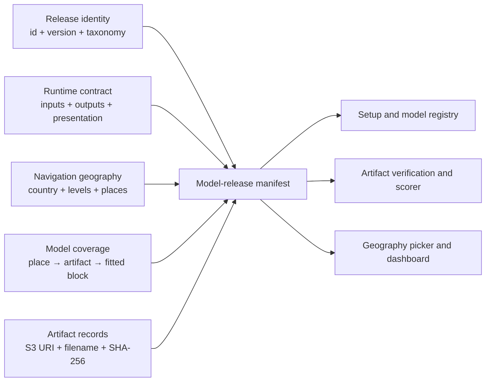
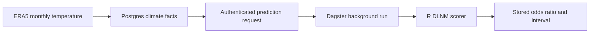
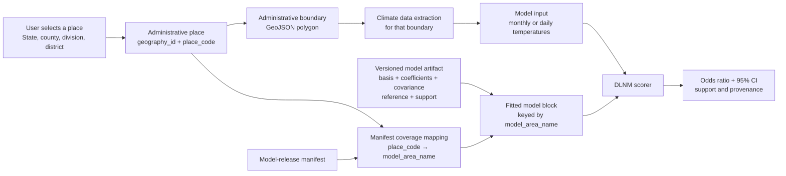

# Modeling

CHART's current fitted health models estimate temperature associations with
low birth weight (LBW) in Madhya Pradesh and Kenya, and under-five mortality
in Madhya Pradesh.

The current model is an **inference demo around already fitted R models**. It
does not train a new model, download climate data, forecast weather, or estimate
an individual baby's probability of low birth weight.

## Current modeling status

All three releases use **Distributed Lag Non-linear Model (DLNM)** terms. A
DLNM represents a non-linear temperature-response relationship while also
representing effects across several preceding time intervals. The releases do
not share one interchangeable input contract.

| Release | Fitted geography | DLNM design | Runtime temperature input |
|---|---|---|---|
| Madhya Pradesh LBW | One supplied MP-wide block and 10 divisions | Binomial logistic DLNM; MP-wide block verified for window 1, divisions fitted for three windows | Three monthly means, newest first |
| Kenya LBW | Five climate-zone blocks used by 46 mapped counties | Binomial logistic DLNM, fitted for three pregnancy windows | Three monthly means, newest first |
| Madhya Pradesh under-five mortality | 10 divisions; no state block | Conditional-logistic case-crossover DLNM | Four daily values, lag 0–3 |

Each scorer returns an odds ratio, 95% confidence interval, training-support
metadata, and immutable model provenance. Training occurred in upstream
restricted-data modeling projects; CHART packages and scores approved fitted
parameters rather than retraining the models.

The ten division models cover Bhopal, Chambal, Gwalior, Indore, Jabalpur,
Narmadapuram, Rewa, Sagar, Shahdol, and Ujjain. The modeller also supplied one
separate MP-wide LBW object. Its fitted rows span Madhya Pradesh, but the
received files provide no reproducible three-window state fitting workflow.
CHART therefore validates only the supplied window 1
for state-level LBW prediction. The under-five mortality release has no state
block, so the state may expose the model in its catalog but cannot run a state
mortality prediction.

### What is directly supported by the source files

| Coverage | What the modeller supplied | What CHART may claim |
|---|---|---|
| MP LBW state | One fitted MP-wide `glm` object with 33,792 fitted observations, its DLNM basis, prediction object, and `MMt = 27` | A separate MP-wide fitted block for source window 1 only |
| MP LBW divisions | Ten division-specific fitted blocks for each of three pregnancy windows | Direct division-level scoring for all three windows |
| Kenya LBW | Five climate-zone-specific fitted blocks for each of three pregnancy windows | County climate input may use its explicitly mapped fitted zone block |
| Kajiado | No county-specific model; manifest maps Kajiado to `South-eastern` | Kajiado boundary supplies climate input and the South-eastern fitted block supplies the response curve |

Both fitting scripts contain later meta-analysis/BLUP exploration. The compact
CHART artifacts use the direct fitted `Model_*` blocks, not those BLUP curves.
Kenya has no supplied Kenya-wide model and no Kajiado-specific fit.

!!! note "MP state coverage follows the supplied fit"
    The compact artifact physically contains only the supplied MP-wide window
    1 block. The retired CHART refitting path cannot create state windows 2 or
    3. Those windows can be added only through a new modeller-supplied release.

## What the estimate means

The scorer compares one three-month temperature profile with a flat reference
temperature profile:

- an odds ratio of `1` means equal modeled odds at the two profiles;
- an odds ratio above `1` means higher conditional modeled odds;
- an odds ratio below `1` means lower conditional modeled odds.

The returned 95% confidence interval represents uncertainty in the fitted
association. It does not include uncertainty from climate inputs, spatial
aggregation, future climate scenarios, survey measurement, or unmeasured
confounding.

!!! warning "Association, not individual risk"
    The output is not an individual probability, diagnosis, causal estimate,
    or clinical decision rule. It is an association conditional on the fitted
    observational model and its covariates.

## Training data and fitting

The saved bundles originate from the Madhya Pradesh LBW modeling project:

```text
DHS India birth and household records for 2015–16 and 2019–21
  → survey clusters assigned to Madhya Pradesh divisions
  → monthly ERA5 maximum-temperature lags joined to births
  → non-linear temperature and lag basis
  → binomial logistic regression
  → versioned fitted blocks and respondent-free inference artifacts
```

The available packaging code uses a B-spline temperature basis, a two-month
lag, and covariates for birth season, relative humidity, maternal age,
residence, education, child sex, BMI, parity, and wealth.

The complete canonical fitting workflow and restricted DHS/NFHS records are
not stored in this repository. The division fitting script and supplied
MP-wide fit belong to the upstream modeling project. CHART stores only code
that packages or scores approved fitted artifacts.

See the [health input contract](health-input-contract.md) for the proposed
source fields, data rights, and unresolved extraction decisions.

## Model-release manifest structure

Each fitted model is installed from a `model-release*.json` manifest below
`pipelines/models/`. The manifest is the contract between setup, geography
navigation, the model registry, the artifact cache, the scorer, and the
dashboard. The `.rds` contains fitted parameters; the manifest explains what
the artifact is, where it applies, how to call it, and how to present its
result.



### Shortened version 1 example

The example below shows one model-supported place. Real manifests repeat
`geography.places[]` and `areas[]` for every place they install or cover.

```json
{
  "schema_version": 1,
  "id": "lbw-mp-1.0.1-compact-review",
  "module": "prediction",
  "outcome": "lbw",
  "climate_hazard": "extreme_heat",
  "health_domain": "maternal_newborn_child_health",
  "version": "1.0.1-compact-review",
  "runtime": {
    "adapter": "compact_r_registry",
    "artifact_type": "rds"
  },
  "input_contract": {
    "variables": [
      {
        "name": "tmax_lag",
        "unit": "Celsius",
        "order": "newest_first",
        "length": 3
      }
    ]
  },
  "output_contract": {
    "effect_measure": "odds_ratio",
    "confidence_level": 0.95,
    "attributable_fraction": "positive_excess_only"
  },
  "presentation": {
    "climate_hazard_label": "Extreme heat",
    "health_domain_label": "Maternal, newborn and child health",
    "outcome_label": "Low birth weight",
    "dashboard_title": "Protecting mothers and babies from extreme heat",
    "population_label": "pregnancies",
    "model_scope_label": "administrative model",
    "visualization": {
      "kind": "odds_ratio_icon_array",
      "figure": "mother-baby",
      "context_figure": "pregnant-woman"
    },
    "editorial_reference_temperature_c": 27.0
  },
  "base_uri": "s3://chart-predictive-models/india/mp/lbw/1.0.1-compact-review",
  "source_git_ref": "modeller-review-required",
  "model_files": [
    {
      "filename": "IN_MP_LBW_tmax_v1.0.1-compact.rds",
      "sha256": "b7460b4772eb006fd01ffc997deb1fe26e8a9e2b651d6c387553dd6befb98069"
    }
  ],
  "geography": {
    "country_code": "IN",
    "country_name": "India",
    "root_id": "geo-in",
    "root_path": "/india",
    "analytics_slug": "madhya-pradesh",
    "levels": [
      { "key": "geo_level_1", "label": "State", "sort_order": 10 }
    ],
    "places": [
      {
        "place_code": "madhya-pradesh",
        "country_code": "IN",
        "level": "state",
        "display_name": "Madhya Pradesh",
        "geography_id": "geo-in-madhya-pradesh",
        "app_level": "geo_level_1",
        "level_label": "State",
        "path": "/india/madhya-pradesh",
        "sort_order": 10,
        "boundary_key": "madhya-pradesh"
      }
    ]
  },
  "areas": [
    {
      "place_code": "madhya-pradesh",
      "country_code": "IN",
      "level": "state",
      "model_file": "IN_MP_LBW_tmax_v1.0.1-compact.rds",
      "model_area_name": "Madhya Pradesh",
      "validated_pregnancy_windows": [1]
    }
  ]
}
```

### Identity and scientific classification

| Field | Meaning and expected value |
|---|---|
| `schema_version` | Manifest layout. Omitted means `1`. Version 1 uses `geography` and `areas`; version 2 uses `place_set` and `coverage`. |
| `id` | Immutable release identifier stored in prediction history, for example `lbw-mp-1.0.1-compact-review`. Never reuse it for different fitted parameters or coverage. |
| `version` | Human-readable release version. A value containing `review` is hidden unless `CHART_ENABLE_REVIEW_MODELS=true`. |
| `module` | CHART analytical module. Current releases use `prediction`. |
| `outcome` | Stable machine code such as `lbw` or `under_5_mortality`; it is not display copy. |
| `climate_hazard` | Stable hazard code such as `extreme_heat`. |
| `health_domain` | Stable grouping code such as `maternal_newborn_child_health` or `child_health`. |
| `source_git_ref` | Source-model revision, tag, or approval reference used for provenance. |
| `release_notes` | Scientific scope, caveats, approval status, and important differences from earlier releases. |

`id`, `outcome`, `climate_hazard`, and `health_domain` are machine-facing
identifiers. Keep them stable and lowercase with underscores or hyphens as
already established by the model family. User-facing capitalization and prose
belong under `presentation`.

### Runtime, input, output, and presentation

| Field | Meaning and expected value |
|---|---|
| `runtime.adapter` | Code adapter that understands the artifact. Current R releases use `compact_r_registry`. A new artifact format needs a tested adapter. |
| `runtime.artifact_type` | File/runtime type, currently `rds`. |
| `input_contract.variables[]` | Inputs expected by the fitted model. Record the machine name, description, unit, interval where relevant, ordering, and exact length. |
| `input_contract.supersedes_release_ids[]` | Older release IDs replaced by this release. It cannot contain the current `id`, empty values, or duplicates. |
| `input_contract.batch_status` | Optional operational statement such as `blocked_pending_modeller_confirmation`; the model catalog uses it to prevent an unsupported batch path. |
| `output_contract.effect_measure` | Statistical quantity returned by the scorer, currently `odds_ratio`. |
| `output_contract.confidence_level` | Confidence interval level as a proportion, currently `0.95`. |
| `output_contract.attributable_fraction` | Interpretation policy. `positive_excess_only` reports no heat-attributable excess when the odds ratio is at or below one. |
| `presentation.*_label` | Reviewed display text for the dashboard and model catalog. Do not derive these labels from machine codes. |
| `presentation.model_scope_label` | Honest fitted granularity, such as `division model` or `climate-zone model`. It describes the fitted block, not necessarily the selected administrative boundary. |
| `presentation.visualization.kind` | Registered renderer. The current accepted value is `odds_ratio_icon_array`. |
| `presentation.visualization.figure` | Main pictogram: `newborn`, `baby`, or `mother-baby`. |
| `presentation.visualization.context_figure` | Context pictogram: `pregnant-woman` or `baby`. |
| `presentation.editorial_reference_temperature_c` | Optional fixed Celsius anchor, allowed from -50 to 60. Omit it to retain each fitted block's bundled reference. |

`input_contract` and `output_contract` are intentionally model-specific. Do
not copy the LBW three-month contract into a daily-lag mortality model merely
because both return odds ratios.

### Artifact location and integrity

| Field | Meaning and expected value |
|---|---|
| `base_uri` | Versioned artifact prefix, normally `s3://<bucket>/<country>/<model>/<version>`. |
| `model_files[].filename` | Plain filename only: no directory components. Every filename must be unique in the release. |
| `model_files[].sha256` | Exactly 64 lowercase hexadecimal characters calculated from the artifact bytes. |

Every `areas[].model_file` must match one entry in `model_files[]`. During
activation, CHART finds that filename below `MODEL_CACHE_DIR`, calculates its
SHA-256, and refuses to load missing or altered bytes. The filename, checksum,
and versioned S3 location should therefore change together for a new artifact.

### Geography describes navigation

The version 1 `geography` object tells setup which country, hierarchy, labels,
paths, and boundary keys exist. It does not by itself claim that every listed
place has a fitted model.

| Field | Meaning and expected value |
|---|---|
| `country_code` | Uppercase ISO 3166-1 alpha-2 code such as `IN` or `KE`. Place records must use the same code. |
| `country_name` | User-facing country name. |
| `root_id` | Stable application ID for the country root, for example `geo-ke`. |
| `root_path` | One-segment URL path such as `/kenya`. |
| `analytics_slug` | Stable slug used by analytical adapters and stored data. |
| `boundary_artifact` | Optional repository-relative boundary file used by this release. |
| `levels[]` | Ordered application levels. Each `key` is stable; `label` is country-specific display text such as `State`, `Division`, or `County`. |
| `places[]` | All navigation places, including parents or locations with no fitted model. |

For each place:

- `place_code` is the stable code stored on `admin_unit` and referenced by
  `areas[]`;
- `geography_id` is the stable ID sent by the browser and prediction API;
- `app_level` must match a `geography.levels[].key`, and `level_label` must
  exactly match that level's label;
- `parent_place_code` builds the hierarchy and must name another declared
  place; parent cycles are rejected;
- `path` must begin below `root_path`;
- `boundary_key` must uniquely match the place identifier in the boundary
  data; and
- `sort_order` controls deterministic display order.

Within one geography, `place_code`, `geography_id`, `path`, and `boundary_key`
must each be unique.

### Areas describe model coverage

`areas[]` is the bridge from a navigable place to a fitted block:

| Field | Meaning and expected value |
|---|---|
| `place_code` | Must identify a place declared by `geography.places[]`. It is unique within the release. |
| `model_file` | Selects one checksummed artifact from `model_files[]`. |
| `model_area_name` | Exact fitted-block key expected by the scorer. This may differ from the administrative display name. |
| `validated_pregnancy_windows` | Optional unique subset of `[1, 2, 3]` proven valid for that fitted block. Omit it for models without pregnancy-window semantics. |
| `country_code` and `level` | When supplied, they must agree with the matching geography place. |

A place present only in `geography.places[]` can appear in navigation and
supply a climate boundary, but it cannot be scored. A place becomes
model-supported only when `areas[]` maps its `place_code` to both a model file
and a fitted `model_area_name`. This distinction is why Turkana can remain
visible while prediction is unavailable, and why a Kenya county can use its
own polygon but score against a shared climate-zone block.

### Version 2 manifests and shared place sets

Version 2 avoids repeating a large geography tree across several model
releases. It replaces `geography` and `areas` with:

```json
{
  "schema_version": 2,
  "place_set": {
    "id": "in-mp-state-divisions",
    "version": "1",
    "path": "pipelines/places/in-mp-v1/place-set.json",
    "sha256": "<64 lowercase hexadecimal characters>"
  },
  "coverage": [
    {
      "place_code": "bhopal",
      "model_file": "example.rds",
      "model_area_name": "Bhopal"
    }
  ]
}
```

The referenced place-set file owns the `geography`, optional boundary shape,
and source/licence provenance. Its repository-relative path may not be
absolute or contain `..`, and its checksum is verified before setup uses it.
A version 2 release must not also declare `geography` or `areas`. The resolved
place codes and the same model-file and fitted-block rules still apply to
`coverage[]`.

!!! warning "Review releases are opt-in"
    Discovery treats any manifest whose `version` contains `review` as
    review-only. Set `CHART_ENABLE_REVIEW_MODELS=true` only in an environment
    approved to expose those releases. Without that flag, setup correctly
    reports zero configured model countries when every installed manifest is
    a review release.

The authoritative validation rules live in
[`backend/chart/model_registry/schemas.py`](https://github.com/CHART-Scope/CHART/blob/dev/backend/chart/model_registry/schemas.py).
For the installation workflow and pre-activation checks, see
[Add a geography and model](add-geography-and-model.md).

## Model artifacts

The release-aware runtime uses respondent-free compact R artifacts:

| Artifact | Contents |
|---|---|
| `IN_MP_LBW_tmax_v1.0.1-compact.rds` | One supplied MP-wide window 1 block plus 10 supplied divisions × 3 pregnancy windows (31 blocks total) |
| `KE_climate_zone_LBW_tmax_v0.2.1-review.rds` | Five fitted climate zones × 3 pregnancy windows |

The `.rds` files are deliberately ignored by Git. Local developers must obtain
approved copies through the project model-artifact process. Deployed
environments retrieve versioned objects from private S3 locations.

`Dlnlm_Objs.rds` is the received source of the single MP-wide fitted object. It
is not evidence of three independently supplied state pregnancy-window blocks.

## Model inputs

The scorer requires exactly three Celsius values:

```json
{
  "area": "Gwalior",
  "trimester": 1,
  "tmax_lag": [37.2, 36.8, 35.4]
}
```

The temperature order is:

| Position | Meaning |
|---|---|
| `lag 0` | Latest month, closest to birth |
| `lag 1` | One month earlier |
| `lag 2` | Two months earlier |

The current API's `trimester` field is a model-window identifier:

| Value | Pregnancy window |
|---:|---|
| `1` | Latest window, corresponding to T3 |
| `2` | Middle window, corresponding to T2 |
| `3` | Earliest window, corresponding to T1 |

!!! important "Counterintuitive numbering"
    The API value `1` means the latest pregnancy window, not the first
    trimester. Preserve this mapping when connecting prepared climate inputs.

## Reference temperatures

- The supplied MP-wide block uses a fixed `27 °C` reference.
- Each division and pregnancy window defaults to the 25th percentile of its
  training temperatures.
- A caller may supply a different `ref`, but the response should be interpreted
  relative to that explicit comparison profile.

The response includes `modelled_temperature_range_c` and
`on_training_support`. The range comes directly from the selected fitted
block's DLNM `Boundary.knots`, so it can differ by location and pregnancy
window. Treat any result outside that block-specific range as extrapolation.

The interactive response exposes two distinct derived percentages:

- `relative_odds_change_percent` is signed by default: `OR 0.62` becomes
  `-38%`, `OR 1.25` becomes `+25%`. When the release's
  `output_contract.attributable_fraction` is set to `"positive_excess_only"`
  the *below-reference* tail (query temperature < reference) is collapsed
  to `0.0` — the paper's editorial scope for that fit does not interpret
  cooler-than-reference temperatures. Above-reference readings are always
  reported at full precision, even when the block's fitted spline returns
  `OR < 1` at that temperature (a small-sample instability in a division
  fit, for example); hiding it would misrepresent what the runtime
  actually computed.
- `attributable_fraction_percent` is always positive-excess-only and
  therefore returns zero when the odds ratio is one or lower. It must not
  be labelled as the signed change in odds.

The dashboard mirrors the server-side policy: when the response reports
`OR < 1` with `relative_odds_change_percent == 0`, the slider stat sentence
renders "At or below the reference — no heat-attributable excess" rather
than a signed number, and the slider itself clamps its lower bound to the
release's reference temperature so the below-reference region is
unreachable from the UI.

## Run the inference service locally

Requirements:

- R 4.0 or newer;
- the `dlnm`, `plumber`, and `jsonlite` R packages;
- an approved compact `.rds` artifact in `pipelines/models/lbw/model/` whose
  filename and SHA-256 match a `pipelines/models/lbw/model-release.*.json`
  manifest.

Launch the release-aware runtime:

```bash
cd pipelines/models/lbw
MODEL_CONTROL_TOKEN=local-only-secret PORT=8000 bash run_registry_api.sh
```

The service listens on `http://127.0.0.1:8000` and starts empty. The backend
loads models on demand via the protected `/models/load` endpoint. Full endpoint
list and a curl example live in
[`pipelines/models/lbw/README.md`](https://github.com/CHART-Scope/CHART/blob/main/pipelines/models/lbw/README.md).

## How CHART uses the model

The direct R service is the deterministic scorer. CHART connects it to prepared
climate data through the Python API and Dagster:



The Python API accepts the planning request, enforces role and geography
access, and stores durable request status. Dagster obtains the required climate
window and calls the R service. See [Climate API](climate-api.md) for the
authenticated request and polling contract.

### How a place picks a model block

Every scored request — batch (`/climate/predict`) or interactive slider
(`/climate/what-if`) — starts from a single `geography_id` sent by the caller.
The complete boundary, manifest, artifact, and scoring relationship is:



- **`geographies`** — one row per selectable place in the UI (state, division,
  district, …). The id is what the frontend sends.
- **`admin_unit`** — one row per analytic area. Linked to `geographies` via
  `admin_unit.app_geography_id`. Carries the stable `code` (`place_code` in the
  release manifest).
- **`model_area_mapping`** — binds each `admin_unit` to a `model_area_key`, a
  `model_file`, and `validated_pregnancy_windows` for one `model_release`.
- **`active_model_assignment`** — pins one active mapping per
  `(admin_unit, module, outcome)` at any time.

The R scorer routes on `area` name (`model_area_key`): the string is compared
against the block-name suffix inside the `.rds` bundle (e.g.
`cbTemp_Bhopal_Sem01` for area `Bhopal`, window `1`). A state-level place
resolves to `Madhya Pradesh` and picks the separately supplied MP-wide block;
a division
resolves to that division's name and picks the division bundle. Two callers
sending different `geography_id`s therefore hit **genuinely different DLNM
blocks with different boundary knots, reference temperatures, and
`n_training`** — this is how the "Viewing for" dropdown on the dashboard
switches models. See [`pipelines/models/inference/adapters/compact_score.R`](
https://github.com/CHART-Scope/CHART/blob/main/pipelines/models/inference/adapters/compact_score.R)
for the block-selection logic and
[Model artifacts](#model-artifacts) for the current bundle filenames.

### Supported geographies and model artifacts

The manifest-driven routing above is country-agnostic; the differences
between releases are entirely encoded in the manifest's `areas` mapping and
the fitted blocks in each `.rds`. The table below lists the geographies
currently shipped in this codebase, the artifact each release scores
against, and the upstream source the modeller supplied.

| Geography | Outcome | Fitted-block granularity | Compact artifact | Manifest | Source |
|---|---|---|---|---|---|
| 🇮🇳 India — Madhya Pradesh | Low birth weight | 1 MP-wide block (window 1) + 10 division blocks (windows 1–3) | `IN_MP_LBW_tmax_v1.0.1-compact.rds` | [`model-release.mp.compact.review.json`](https://github.com/CHART-Scope/CHART/blob/dev/pipelines/models/lbw/model-release.mp.compact.review.json) | Zhu Z, Zhang T, Benmarhnia T, et al. *Lancet Planet Health* 2024 |
| 🇮🇳 India — Madhya Pradesh | Under-five mortality | 10 division blocks (no state block) | `IN_MP_U5M_tmean_v0.1.0-compact.rds` | [`model-release.mp.review.json`](https://github.com/CHART-Scope/CHART/blob/dev/pipelines/models/under_five_mortality/model-release.mp.review.json) | Case-crossover DLNM using NFHS-7 birth histories |
| 🇰🇪 Kenya — 47 counties | Low birth weight | 5 climate-zone blocks (each window 1–3), county→zone map | `KE_climate_zone_LBW_tmax_v0.2.1-review.rds` | [`model-release.kenya.review.json`](https://github.com/CHART-Scope/CHART/blob/dev/pipelines/models/lbw/model-release.kenya.review.json) | Climate-zone recomposition of Kenya DHS |

Two learnings the release shape encodes:

- **The polygon and the fitted block need not match one-to-one.** A place's
  boundary controls climate extraction (its geometry), while the fitted
  block is chosen by whatever the manifest's `areas[*].model_area_name`
  says — often the same string ("Madhya Pradesh"), sometimes a
  zone-of-many-counties ("South-eastern"), sometimes a pregnancy-window
  suffix ("Bhopal_Sem01"). If a place resolves to no `model_area_name`
  (Turkana, Kajiado sub-counties), the county is still selectable for
  climate context but returns no prediction.
- **Every release has its own reference anchor.** Some fits are anchored
  at a fixed editorial reference (MP LBW: 27°C, matching the source
  paper); others let each block use its own modeller-computed MMT (the
  Kenya climate-zone bundle and U5M). The `presentation.editorial_reference_temperature_c`
  field on the manifest is what tells the runtime to override the bundled
  MMT — omit it to keep whatever the `.rds` was fit against.

!!! note "Frontend contract"
    Any UI panel that calls a per-place model endpoint must send the district
    id when the user has picked one, not just the parent state id. On the
    dashboard the two hooks that do this are `useAutoPrediction` and
    `useWhatIfScore`, both computing `effectiveGeographyId = adminUnit ??
    geographyId`. Panels that also read per-place history
    (`listPredictionRequests`) apply the same rule.

### Adding another model in the same release shape

When a new outcome or country is added, the routing above stays intact as long
as the manifest supplies one `admin_unit`-scoped row per model block. The
release process is described in
[Add a geography and model](add-geography-and-model.md); the block-name
convention the R scorer expects lives beside the model in
[`pipelines/models/`](https://github.com/CHART-Scope/CHART/tree/main/pipelines/models).

## Releasing a new model

Every release should provide:

1. a new immutable versioned artifact filename;
2. the training data and eligibility description;
3. the outcome definition and covariate specification;
4. the exposure variable, units, aggregation, lag order, and pregnancy-window
   mapping;
5. geography mappings for every model block;
6. training-support ranges and reference temperatures;
7. validation results against known profiles;
8. a cryptographic checksum for each artifact;
9. limitations, intended use, and approval record.

The current demo reports the model filename and semantic version, but it does
not verify an artifact checksum in the R response. Runtime checksum enforcement
should be completed before treating model activation as production-grade.

## Limitations and open work

- The current review implementation covers Madhya Pradesh and Kenya; only
  manifest-validated place/window combinations may run.
- Results depend on observational DHS/NFHS data and modeled ERA5 exposure.
- Bounding-box or administrative aggregation can differ from individual
  exposure.
- Exact upstream training filters and survey-design handling still need a
  canonical, reviewable release record.
- Climate uncertainty and model uncertainty are not combined.
- The direct port `8000` service has no end-user authentication; CHART users
  should access prediction through the authenticated Python API.
- New geographies require approved health data, exposure joins, fitted model
  blocks, validation, and a versioned artifact release.

For implementation-level details, see the
[LBW demo README](https://github.com/CHART-Scope/CHART/blob/dev/pipelines/models/lbw/README.md).
