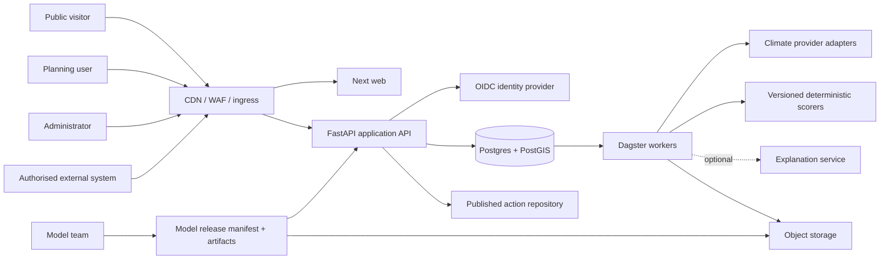
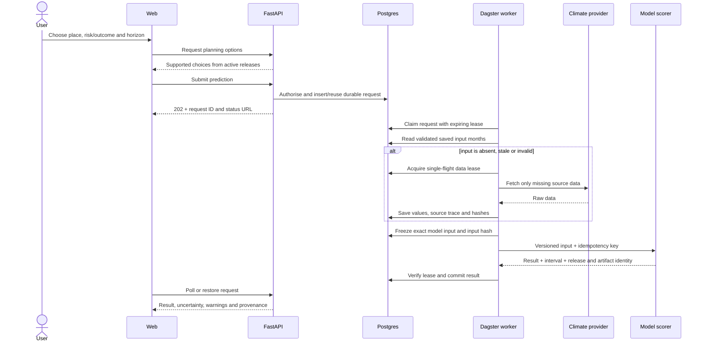
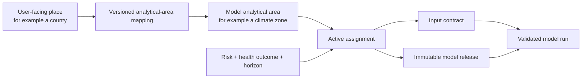
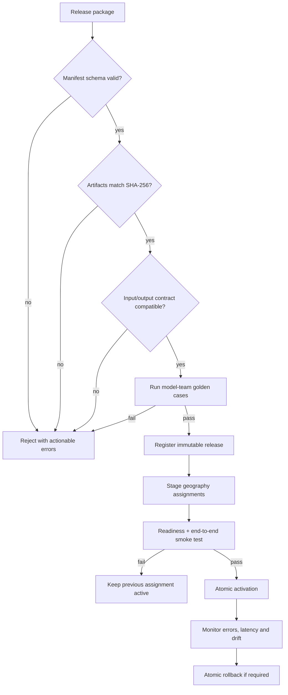
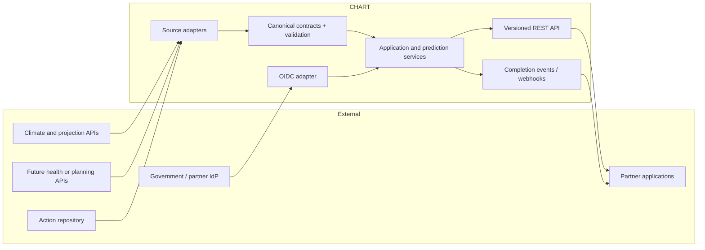
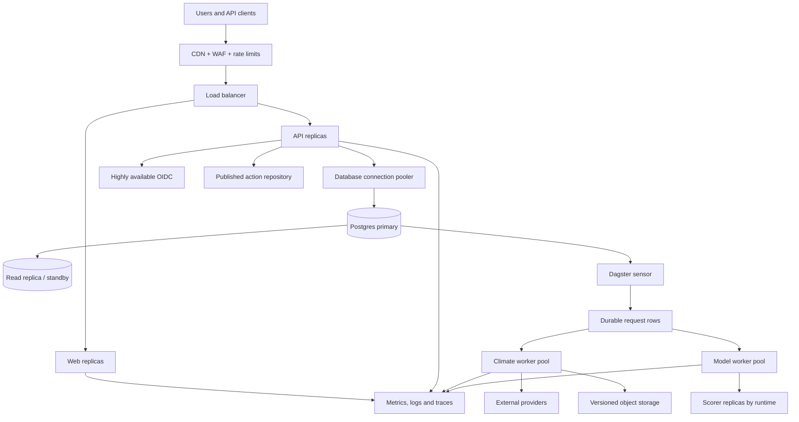
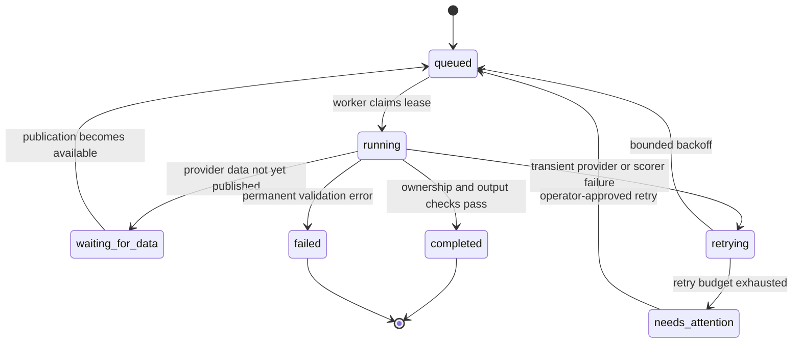

# System architecture and requirements

## Purpose and status

This is the concise target architecture for CHART as a multi-country
climate-health planning platform. It covers installation, geography and model
onboarding, climate-data acquisition, prediction, planning, public actions,
audit, and future API integrations.

The capacity figures below are **design targets**, not measured guarantees.
Production sign-off requires the load, recovery, and failover tests listed at
the end of this page.

## Who uses CHART

| User | Main need |
|---|---|
| Public visitor | Browse published risks, evidence, and actions without signing in |
| Planning lead | Select an authorised geography, assess risks and outcomes, run scenarios, and save a plan |
| Planning collaborator | Review a shared workspace and contribute to planning decisions |
| Country administrator | Install CHART, manage users, roles, geography access, and supported models |
| Model and data operator | Publish signed model releases, monitor data jobs, and investigate failures |
| External system | Read published data or submit authorised work through a versioned API |

Normal users select planning concepts, dates, and places. They never select a
model file, enter a temperature, or change fitted model parameters.

## Design envelope

The sizing unit is one independently deployed CHART installation. A regional or
global service can use multiple installations or scale the shared services
horizontally.

| Measure | Launch target | Scale target |
|---|---:|---:|
| Registered users | 10,000 | 50,000 |
| Monthly active users | 2,000 | 10,000 |
| Daily active users | 500 | 2,000 |
| Peak signed-in sessions | 250 | 1,000 |
| API traffic | 25 sustained / 100 burst requests/s | 150 sustained / 500 burst requests/s |
| Prediction submissions | 2,000/day | 10,000/day, 200/minute burst |
| Concurrent deterministic model jobs | 10 | 50 |
| Concurrent provider acquisitions | 3/provider | 10/provider, configurable |
| Countries / user-facing places | 10 / 5,000 | 50 / 50,000 |
| Registered model releases | 50 | 250 |

Planning assumptions:

- traffic is read-heavy: approximately 95% reads and 5% state-changing calls;
- a prediction is accepted asynchronously, so its HTTP request does not hold a
  worker while climate data or a model is running;
- at least 90% of prediction input months should be served from validated saved
  climate data after warm-up;
- duplicate work is collapsed by idempotency keys and single-flight acquisition
  leases;
- provider limits are lower than user-facing API limits, so excess acquisition
  work waits durably instead of overwhelming an external API;
- raw-file storage is sized independently from database storage. For example,
  200 unique 250 MB acquisitions/day is about 50 GB/day, 4.5 TB for 90 hot
  days, and 18.3 TB/year before compression or archival lifecycle rules.

These numbers deliberately provide room for national programmes and public API
traffic without requiring every deployment to start at the scale target.

## Current foundation and scale work

| Already in the repository | Required to claim the scale target |
|---|---|
| One FastAPI business API and thin Next browser proxies | Multiple stateless web and API replicas behind a load balancer |
| Postgres-backed durable requests, idempotency, and expiring worker leases | Highly available Postgres, connection pooling, tested backup and failover |
| Dagster background acquisition and prediction | Independently scaled worker pools and provider-specific concurrency controls |
| Manifest-driven immutable model releases and geography mappings | Central object storage, atomic promotion/rollback, and release observability |
| Source provenance, hashes, audit, liveness, and readiness | SLO dashboards, alerting, capacity tests, and regular recovery exercises |

The left column is a sound functional foundation. The right column is necessary
production engineering; it must not be represented as already proven.

## System context

The browser talks only to the public ingress. FastAPI owns access checks and
business rules. Postgres owns durable request state. Dagster owns background
execution. A model result remains available even when the optional explanation
service is disabled or unavailable.

## Functional requirements

| ID | Requirement | Acceptance outcome |
|---|---|---|
| FR-01 | Public discovery | Anyone can read published hazards, taxonomies, evidence, and actions without authentication. |
| FR-02 | Identity and scope | OIDC login resolves roles and exact geography access; every protected read and write enforces both. |
| FR-03 | Installation | An authorised administrator can bootstrap, reset, and complete onboarding safely and idempotently. |
| FR-04 | Data-driven geography | Country, parent/child choices, boundaries, analytical areas, and place-to-model mappings come from versioned release data, not UI code. |
| FR-05 | Risk and outcome catalog | Risks, health outcomes, supported horizons, input contracts, and labels are versioned data so new model families do not require LBW- or heat-specific UI logic. |
| FR-06 | Climate preparation | CHART resolves the required time window, fetches only missing data, validates units/freshness/completeness, and saves source provenance and hashes. |
| FR-07 | Durable prediction | Submission returns a durable request identifier; work survives browser, worker, and host restarts and can be polled or restored later. |
| FR-08 | Deterministic inference | The active geography/outcome model receives a validated input contract and returns a versioned result with uncertainty and support warnings. |
| FR-09 | Planning workspace | Authorised users can compare horizons or scenarios, select actions, record planning decisions, and revisit saved work. |
| FR-10 | Model lifecycle | Operators can validate, register, activate, supersede, and roll back immutable releases without changing deployment secrets or application code. |
| FR-11 | Integration API | Versioned APIs support catalog reads, geography/model discovery, prediction submission/status, and approved export; webhooks or polling expose async completion. |
| FR-12 | Operations and audit | Operators can see request state, data/model provenance, release health, failures, and security-relevant actions without exposing secrets. |

## End-to-end prediction

The database request and lease are the back-pressure boundary. User traffic can
burst while provider calls and model jobs remain within configured concurrency
and rate limits.

## Geography, risk, and model resolution

This middle layer is essential. A user can work with familiar administrative
geography while the model uses a different analytical geography. The mapping,
its version, and the selected model release are retained with every result.
Unsupported places remain visible but cannot silently fall back to another
area or model.

## Model onboarding and update

The release manifest is the control-plane contract. It identifies the model
family, risk and health outcome, artifact locations and hashes, runtime,
inputs, outputs, supported geography mappings, training support, and display
metadata. Artifacts live in object storage; environment variables contain
credentials and service locations only, never the model catalog.

## Integration architecture

Each external source is isolated behind an adapter with timeouts, bounded
retries, circuit breaking, source-specific rate limits, and provenance. External
payloads are converted to canonical CHART contracts before reaching business
or model logic. Future integrations such as DHIS2 or FHIR are possible adapter
implementations, not dependencies of the core architecture.

## Scalable production topology

The current single-host AWS deployment is suitable for development, demos, and
small pilots; it is not evidence for the scale target. Production scale needs
managed or highly available Postgres, object storage, multiple API/web/worker
replicas, health-based autoscaling, and no public access to Dagster or scorers.
Postgres remains the durable queue until measurements demonstrate a need for a
separate message broker.

## Non-functional requirements

| ID | Requirement | Target at scale envelope |
|---|---|---|
| NFR-01 | Availability | 99.9% monthly for authenticated API and web; public cached catalog may target 99.95%. |
| NFR-02 | Interactive latency | p95 under 500 ms for cached API reads, under 1 s for writes, and under 2.5 s for key web views on representative 4G. |
| NFR-03 | Async latency | Prediction accepted p95 under 1 s; cached-input deterministic result p95 under 60 s; cold provider work reports progress and uses a source-specific completion budget. |
| NFR-04 | Capacity | Meet the scale-target rows above with CPU below 70%, DB connections below 80%, and no lost or duplicate committed results. |
| NFR-05 | Recovery | Multi-AZ production RPO at most 15 minutes and RTO at most 2 hours; quarterly restore test. |
| NFR-06 | Security | TLS in transit, encryption at rest, OIDC, least privilege, geography-level authorisation, secret manager, audit, dependency and image scanning. |
| NFR-07 | Privacy | Collect the minimum identity data; do not place person-level health records in model artifacts, logs, analytics, or public APIs. |
| NFR-08 | Integrity and reproducibility | Every result retains request, input, source, mapping, release, artifact hash, calculation version, and execution identifiers. |
| NFR-09 | Resilience | Idempotency, expiring leases, bounded retry with jitter, circuit breakers, dead-letter/operator recovery, and graceful degradation of optional services. |
| NFR-10 | Accessibility | WCAG 2.2 AA for supported user journeys; keyboard, focus, contrast, error, and screen-reader testing. |
| NFR-11 | Interoperability | Versioned OpenAPI, stable identifiers, UTC ISO-8601 dates, explicit units, pagination, idempotency keys, and backward-compatible deprecation windows. |
| NFR-12 | Observability | Correlated request/job IDs, structured logs, metrics and traces; alerts for SLO burn, queue age, provider errors, model errors, and data freshness. |
| NFR-13 | Maintainability | Thin routes, business logic in services, manifest-driven models/geographies, no model-family conditionals in shared UI, and automated contract tests. |
| NFR-14 | Data lifecycle | Configurable retention by data class; 30-day application audit default, immutable release provenance, and object-store lifecycle to archive or delete raw data by policy. |

## Failure and recovery behavior

A stale worker cannot commit after losing its lease. Optional explanations,
email, analytics, and the remote action repository must not block a completed
deterministic result. When a provider is unavailable, saved results remain
readable and new work stays queued or fails with a stable, actionable reason.

## Capacity validation and release gates

Before claiming the scale target, test a production-like environment with the
same database class, replica counts, model runtimes, and representative payloads:

1. Sustain 150 API requests/s for 60 minutes and burst to 500 requests/s for
   five minutes, with 1,000 concurrent authenticated sessions.
2. Submit 200 predictions/minute, prove durable acceptance, and drain 10,000
   mixed cached/cold requests without lost or duplicate committed results.
3. Stop API, worker, scorer, and provider connections during load; verify lease
   expiry, bounded recovery, queue-age alerts, and readable completed results.
4. Restore Postgres and object metadata from backup and meet the RPO/RTO target.
5. Verify geography denial, role denial, API rate limits, artifact tampering,
   webhook replay protection, and audit redaction.
6. Run model contract and golden-case tests for every active geography/outcome
   assignment before atomic activation.

Until those gates pass, capacity should be described as the **target design
envelope**, with measured results published separately for each deployment.
