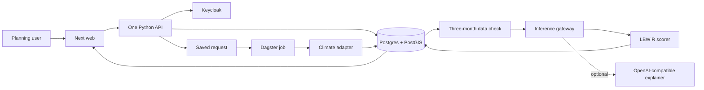

# CHART technical design

Last updated: 27 July 2026

This document describes the system that is now in the repository and the work
that is still open.

## 1. Product outcome

An authorised planning user:

1. chooses a place and either the next three months, the next hot season, or a
   long-term heat period;
2. sees CHART collect three monthly temperature values;
3. can inspect the source and date for every value;
4. sees one cumulative population-level association for the selected
   three-month period, without being asked to choose a pregnancy stage;
5. sees the saved LBW results and uncertainty;
6. can reload the same result later.

The user never types temperatures, a model filename, a reference temperature,
or a climate source.

## 2. Running system



| Part | Owner | Rule |
|---|---|---|
| Web | `web/` | current planning UI; display and browser/session forwarding only |
| Application API | `backend/chart/` | all routes, access checks, and application rules |
| Database | SQLAlchemy + Alembic | only CHART schema owner |
| Background work | `orchestration/` | thin Dagster calls into Python services |
| Climate code | `pipelines/` | source-specific download and area calculation |
| Statistical model | LBW R service | deterministic result; never fitted inside CHART |
| Explanation | optional compatible API | may explain but cannot change or block the result |

Fastify and Drizzle are retired. Their service, tests, build, package, runtime,
deployment, and migration path have been removed. The bundled solution fallback
is owned by the Python solution-repository adapter.

## 3. Prediction flow

The order is fixed:

1. `POST /climate/predict` saves one request.
2. A Dagster sensor reserves it with a random, expiring database lease before
   emitting a run. The worker must present the same lease for every state
   transition and heartbeats it during provider downloads.
3. CHART saves the exact timestamp at which the user asked, then resolves the requested place and
   three target months relative to that day.
4. Missing climate values are fetched and saved with source details.
5. CHART saves the exact three input rows and one input hash.
6. Only then does the active place model run once using the same three climate
   values. The current planning UI requests the validated cumulative block
   stored internally as model window `1`; it does not present that internal key
   as a pregnancy stage.
7. The scorer must echo the exact inputs and return the configured model
   version and SHA-256. CHART rejects non-finite numbers, invalid confidence
   intervals, changed inputs, or a different artifact.
8. The result, model release, artifact hash, request ID, Dagster run ID, and
   source trace are returned to the dashboard.

If data is absent, stale, sample-only, or invalid, the model does not run.
If a sensor, worker, or host dies, its lease expires and the request is
requeued with bounded backoff and a new token. A stale worker can no longer
commit. Climate acquisitions are also single-flight by place, boundary,
source, issue, and month set, so concurrent requests do not duplicate large
downloads.
`make run` starts the R scorer with the web app, Python API, and Dagster and
checks that both MP model files exist first. If the scorer is temporarily down,
the request keeps its saved three-month climate input and reports a clear
service error. Submitting the same estimate again reuses that input instead of
downloading the climate data again.

## 4. Climate data contract

The model input is exactly three consecutive calendar months, newest first:

```txt
planning month, previous month, two months before
```

Every monthly value must contain:

- monthly mean of daily maximum 2 m temperature;
- degrees Celsius;
- CHART place and analytical area code;
- boundary and area-calculation versions;
- source class, name, version, URL, and licence;
- issue, valid, download, and freshness dates;
- observed, forecast, projection, or sample label;
- quality state;
- raw-file location and SHA-256 hash;
- ensemble or scenario details when relevant.

The three rows must use the same place, area shape, calculation method,
variable, and unit. A state value cannot be sent to a division model.

### Source status

| Need | Source | Code status | Release requirement |
|---|---|---|---|
| Past and historical charts | ERA5 | working, including polygon and latitude-weighted calculation; exact-month live MP state pull passed | complete the pinned two-division check |
| Current supported future planning months | official C3S seasonal monthly data, ECMWF system 51 | adapter, Dagster load, source trace, tests, and live MP state pull passed | policy proof request `7`, Dagster `e6bcd9e0-445e-4367-a3b5-2069c1fa8bef`, climate run `13` saved October–December from the July issue; raw SHA-256 `3299707ee2098cc8d1be73969d6902685d691a2e4983be3864350736768922b1` |
| 0–15 day weather detail | ECMWF IFS ensemble on AWS Open Data | next; not enabled | implement full-month coverage and ensemble rules |
| Long-term planning scenario | ISIMIP3b bias-adjusted daily `tasmax`, W5E5 v2.0 | working for MP March–May 2031–2040 with an explicit SSP1-2.6, SSP3-7.0, or SSP5-8.5 choice | live SSP3-7.0 request `13`, Dagster `641b6344-552c-447d-958f-7c76a18bdad1`, climate run `20`, raw manifest SHA-256 `89f1f18cc8faaf1555884c008538999f81a88454735fd52b5553fafe1e3f4dc5` |

ERA5 is historical/reanalysis data, not a future forecast. C3S seasonal data is
shown as a seasonal outlook, not precise weather. Long-term data must always be
called a scenario or projection.

The versioned `monthly-planning-v2-projection` rule is based on the saved day when the user
submits the request:

- months before the current calendar month accept ERA5 only;
- the current month through the latest published C3S six-month lead accepts
  C3S seasonal data only;
- later calendar months are unavailable as forecasts. The separate long-term
  option requires an explicit approved scenario and uses March–May averages
  across 2031–2040; it never pretends those values are an exact 2040 forecast.

The dashboard uses the same C3S publication rule (new issue from the 7th of
each month) to set its last selectable month. Stored ERA5 rows are ignored for
current or future months, even when no seasonal row exists. CHART returns
unavailable instead of silently changing source.

The three standard future choices exposed from the ISIMIP3b forcing set are
SSP1-2.6 (lower emissions), SSP3-7.0 (high emissions), and SSP5-8.5 (very high
emissions). SSP changes the climate input only; the same place-selected LBW
model scores every option. CHART preserves the model's training-support warning
when a projected temperature is outside its fitted range.

A mixed three-month model window is expected. For a July request made in July,
July is a C3S forecast while May and June are completed historical ERA5 inputs.
The UI labels those roles separately. Dagster checks all three rows before the
model call, replaces any sample or stale row, and requests only the exact ERA5
months required. An incomplete ERA5 month is rejected.

Live proof request `10`, Dagster run
`7da1cf60-f391-4f75-b78e-264635f53361`, combined July–August C3S climate run
`16` with June ERA5 climate run `17`. The ERA5 request downloaded only June,
replaced the sample row, and the deterministic prediction completed.
The exact July UI case also passed as request `9`, Dagster run
`6dc4dc79-c29c-4496-aec5-2a608ab30e3d`: July came from C3S run `16`, June from
ERA5 run `17`, and May from exact-month ERA5 run `19`.

The ECMWF 0–15 day feed is not used as a replacement for a complete monthly
LBW input. It remains unavailable to this model until the reviewed integration
can produce a complete month. This keeps a short weather forecast from being
mislabelled as a monthly temperature estimate.

The UI now leads with “Next 3 months,” “Next hot season,” and “Long-term heat.”
A custom month remains under More options. The backend owns the dates and
resolves each shortcut before the existing source-selection flow. For Madhya
Pradesh the configured
hot-weather season is March–May, following the
[IMD hot-weather seasonal outlook](https://internal.imd.gov.in/pages/press_release_mausam.php?article_id=422421688.0).
When C3S cannot yet cover the next hot season, the user can still save the
plan. It stays in `waiting_for_data`; the Dagster sensor queues it automatically
when the expected C3S issue can cover all three months. On 22 July 2026, for
example, March–May 2027 becomes runnable from 7 December 2026. CHART does not
substitute a long-term projection for the missing seasonal forecast.

The custom month calendar is limited to the same live range returned by the
backend. The user supplies a date, never temperatures or model parameters. A
future natural-language resolver may map “next heat season” to the same backend
option; source selection, saved data checks, downloading, and model execution
do not change. The saved request day is part of request identity, so repeating
the same planning request on a later day performs a new source/data check
instead of returning an older cached request.

The long-term MP slice uses the median of five pinned ISIMIP3b models:
GFDL-ESM4, IPSL-CM6A-LR, MPI-ESM1-2-HR, MRI-ESM2-0, and UKESM1-0-LL. The saved
manifest keeps every repository file name, version, checksum, each model's
monthly result, and the full model range. The model receives the three median
values in its existing May, April, March order. The model range is climate
uncertainty and remains separate from the health model's confidence interval.

Live SSP3-7.0 proof request `13` completed through Dagster run
`641b6344-552c-447d-958f-7c76a18bdad1`. It saved March `34.5581°C`, April
`39.0560°C`, and May `41.2928°C`, then produced LBW odds ratio `1.1444` (95%
CI `0.8967–1.4604`) with model release `1.0.0`. This is a scenario result, not
an individual clinical prediction or a precise future weather forecast.

## 5. Places, boundaries, and models

The current release contains Madhya Pradesh state and ten divisions.

`AppGeography` is the place selected by a user. `AdminUnit` is the analytical
area with its boundary. `ModelAreaMapping` connects that area to one entry in a
versioned `ModelRelease`.

The selected place therefore decides both:

- which coordinates and boundary the climate adapter uses;
- which model file and area name the scorer uses.

The model team supplies `model-release.json` with file hashes, model version,
Git reference, input definition, and place mappings. See
[Add a geography and model](add-geography-and-model.md).

Kajiado remains unavailable until it has its own fitted model and equivalent
boundary/data checks. The MP model must never be reused for Kenya.

## 6. Saved data

Important tables:

| Table | Purpose |
|---|---|
| `geographies` | places shown to users |
| `chart_geographies`, `admin_unit` | analytical areas and boundaries |
| `data_source`, `provenance`, `climate_run` | source and immutable source snapshots for each download |
| `district_climate` | one place, month, variable, and value per row |
| `climate_input_window`, `climate_input_month` | the exact three rows sent to a model |
| `model_release`, `model_area_mapping`, `active_model_assignment` | immutable model version, place mapping, and place-scoped activation |
| `prediction_request` | request, progress, ownership lease, selected data/model hashes, and result |
| `ingestion_lease` | single-flight ownership and recovery for provider acquisitions |
| `users`, `user_roles`, `user_geography_scopes` | user access |
| `workspaces`, `workspace_members`, `setup_state` | application setup and planning ownership |

Alembic revisions `001` through `013` create or adopt these tables. Revision
`007` adopts old application tables without deleting their data and now fails
fast when an existing table has an incompatible shape. Revision `013` adds
scoped model activation, request and ingestion leases, immutable artifact and
source snapshots, database-enforced request states, and the source-selection
indexes. Both an empty PostGIS database and an existing CHART database must
upgrade to `013` before the API reports ready.

## 7. Python API

Public reads:

- `GET /live` for process liveness;
- `GET /ready` for database, migration-head, and model-assignment readiness;
- `GET /health` as the readiness-compatible legacy endpoint;
- `GET /geographies`
- `GET /climate/locations`
- `GET /hazards` and `GET /hazards/{id}`
- `GET /solutions` and `GET /solutions/taxonomies`

Protected application routes:

- `GET /auth/me`
- setup and reset under `/setup`
- users under `/users`
- workspaces under `/workspaces`
- `POST /climate/preview`
- `POST /climate/predict`
- `GET /climate/prediction-requests/{id}`

`GET /setup` remains public so a client can discover first-run state.
`POST /setup/bootstrap` is disabled unless the deployment provides
`CHART_BOOTSTRAP_TOKEN`, and the caller must send the same value in
`X-CHART-Bootstrap-Token`. First-run setup is serialized in the database and is
safe to retry only for the same operation payload after a partial failure. Keycloak geography
groups are read one parent at a time, existing groups are reused, and a second
request that creates the same group first is re-read instead of reported as an
account conflict. Once setup completes, public bootstrap is locked.

Prediction routes enforce both an allowed planning role and the user's place.
The same place check applies when reading status or results.

Ordinary users are scoped strictly to the Keycloak groups they were assigned.
Installation administrators (`chart_admin`) get two additional broadenings so
a self-hoster can operate their instance without editing Keycloak for every
model: (a) each Keycloak group collapses to its country root so the admin can
context-switch inside a country they own, and (b) the admin's scope is
unioned with the family root of every geography that has an active model
release. Because `/model-releases` is already a public endpoint, this union
does not expose any information a caller could not already discover — it just
wires the Settings context switcher to what the deployment actually holds.
Operators who want the strict Keycloak-only behavior for admins can set
`CHART_ADMIN_SEES_ALL_MODEL_GEOGRAPHIES=false`.

## 8. Inference

`chart.inference` is the only Python entry point.

The statistical provider defaults to `lbw_r`. It returns the authoritative
area, input values, reference, odds ratio, 95% interval, support warning, model
file, model version, and model SHA-256. The R container verifies both configured
artifacts before startup. Provider calls use a deterministic idempotency key,
short bounded retries with jitter, and a process circuit breaker.

The optional explanation provider uses an OpenAI-compatible
`/chat/completions` endpoint. A local llama.cpp/Qwen server or hosted compatible
service can be selected with configuration only:

```txt
INFERENCE_LLM_ENABLED
INFERENCE_LLM_BASE_URL
INFERENCE_LLM_MODEL
INFERENCE_LLM_API_KEY
INFERENCE_LLM_TIMEOUT_SECONDS
```

It is disabled by default. Empty output, bad output, timeout, or an unavailable
provider returns no explanation and leaves the numerical result unchanged. The
numerical result is committed first, so explanation work cannot delay it
becoming available to the user.

## 9. User interface

The connected planning page in `web` shows:

- next three months, next hot season, long-term heat, and a secondary custom
  month choice;
- waiting for forecast, queued, getting data, checking three months,
  calculating, completed, or failed;
- the planning result as the main focus;
- a compact collapsed “Data used” section that keeps the climate source visible
  and reveals the three temperatures, issue and download dates, source record
  hashes, source links, and exact newest-first model order on demand;
- request and Dagster run identifiers;
- one cumulative odds ratio and 95% interval validated for that model/place
  mapping, plus reference temperature and support warning;
- plain wording that the current state-wide result is a population association,
  not a pregnancy-stage result, individual probability, or diagnosis;
- optional explanation when available.

Normal users cannot edit model parameters. The Expert Analytics downscaling
step is left as a short code comment at the climate-area calculation point and
stays disabled until its method is approved.

## 10. Deployment

One Python image is used by the API and Dagster. EC2 deployment:

1. starts Postgres/PostGIS;
2. runs Alembic;
3. loads versioned MP boundaries and place mappings;
4. registers and activates the model for each explicit analytical area only
   when both files and expected SHA-256 values are configured;
5. starts the Python API, Dagster, `web`, Keycloak, and optional R scorer;
6. waits for `/ready` and verifies that `/api/build` reports the deployed commit;
7. exposes the web and `/chart-api` through nginx over HTTPS, unless TLS is
   explicitly declared to terminate at an upstream load balancer.

`CDSAPI_KEY` is a deployment secret. Users do not enter Copernicus credentials
in the UI. Refresh and ID tokens remain in secure HttpOnly cookies; only the
short-lived access token exists in browser memory. The raw climate file is retained locally now; moving raw files to a
CHART-owned S3 bucket is still open.

## 11. Tests required for release

- all Python API/data tests;
- Dagster sensor/job tests proving data runs before the model;
- lease expiry/requeue and stale-worker rejection tests;
- ERA5 polygon tests;
- C3S request, area calculation, Celsius, lead-month, and file-hash tests;
- authentication, role denial, and place denial route tests;
- fresh and existing PostGIS migration checks;
- web typecheck and production build;
- API and deployment-image smoke checks;
- one live CDS seasonal pull and one live R state/division prediction before
  production sign-off.

## 12. Done and next

### Done in code

- one Python API and one Alembic migration chain;
- Fastify/Drizzle removal;
- production deployment of the canonical `web` app;
- secure bootstrap, exact descendant-only geography authorization, and
  HttpOnly refresh-token handling;
- crash-safe prediction and ingestion leases with heartbeat and bounded
  dispatch;
- place-scoped model activation and end-to-end artifact checksum verification;
- strict source units, immutable per-run source snapshots, exact source
  cutoffs, and complete-day checks;
- MP state + ten division boundaries and model mappings;
- source-neutral climate records and exact three-month saved inputs;
- date-based monthly source routing that prevents future ERA5 use;
- ERA5 polygon calculation;
- official C3S seasonal adapter and Dagster integration;
- live C3S MP state proof: run `11`, input window `1`, input hash
  `8c994eb7dc9c1e864f24f1e845130a7f8a55c921ad995f69c8b5c34a75b166e8`;
- relative-date policy proof: request `7` used only C3S October–December data,
  saved input window `4` with hash
  `1d0a19d8f7e735e38aa347617b9cb4d87dbccc2b817f20bf0dc805b109b22f2f`,
  and completed the LBW prediction at odds ratio `1.1287`;
- current end-to-end proof: request `21` used saved C3S August–October values
  `28.9438`, `31.0012`, and `32.6996°C`, input window `7`, input hash
  `9be94a8c449c0ed5bc4086ae88ba2f61074bc7ffd73ebab078a904455a320a33`,
  and completed the LBW result at odds ratio `1.2025` with interval
  `1.0562–1.3690`;
- connected `web` proof: authenticated request `24` displayed those
  three saved ECMWF records, completed the same model result through Dagster,
  and restored the temperatures, source trace, result, and recent-run entry
  after a browser reload;
- data-before-model request flow;
- place-selected model release;
- deterministic inference gateway plus optional compatible explanation adapter;
- dashboard data trace and prediction result;
- user-scoped recent prediction history that restores active and completed runs
  after a dashboard reload;
- saved next-hot-season plans that queue automatically when C3S publishes the
  required forecast;
- model-area metadata that selects the correct release for the chosen place;
- a planning UI that requests one cumulative three-month result and does not
  expose internal model-window keys as pregnancy stages;
- removal of dashboard mock KPIs, mock risk groups/actions, and the unshaded
  map; a future map must be driven by real temperature values;
- all three standard ISIMIP3b future choices, with no silent default;
- EC2 packaging and CI coverage;
- concise place/model handoff documentation;
- future VRA module placeholder only.

### Required before production sign-off

1. obtain written model-team confirmation that internal window `1` is the
   approved cumulative planning block and confirm the newest-first temperature
   order;
2. run state and division golden comparisons against the approved model-team
   outputs; the local audit found identical state Sem01/Sem03 temperature
   coefficients while all ten division bundles contain three distinct blocks;
3. exercise one authenticated request through deployed web, Dagster, database,
   and scorer;
4. record the model release and final UI evidence alongside the climate run and
   input hashes already captured above.

### Later work

1. ECMWF AWS near-term adapter;
2. additional long-term periods only after planning users agree they are useful;
3. CHART-owned S3 raw-file storage and retention;
4. saved workspace planning cadence and automatic next-date suggestion;
5. Kajiado model release;
6. VRA implementation after its indicators and inputs are agreed.
