# CHART — Technical Design Document

*System design & build reference*

**Climate × Health Adaptation & Resilience Tool** · Scope Impact · open-source Digital Public Good

**Stack:** React/TypeScript frontend · Python app + engine (FastAPI, one modular monolith) · Dagster (data plane) · Keycloak (identity) · PostgreSQL + PostGIS (SQLAlchemy + Alembic) · S3/MinIO · AGPL-3.0
**MVP scope:** extreme heat → low birth weight, two geographies — Madhya Pradesh (India, state), Kajiado (Kenya, county).

Standard to hold while building: *could a developer build from this?* Prose is minimal; specs, tables, and diagrams lead.

---

## Contents

1. [Overview](#1-overview)
2. [Architecture](#2-architecture)
3. [Frontend & UI](#3-frontend--ui)
4. [Engine & repository layout](#4-engine--repository-layout)
5. [Requirements](#5-requirements)
6. [Data flows](#6-data-flows)
7. [Data model](#7-data-model)
8. [API surface](#8-api-surface)
9. [Technology & infrastructure](#9-technology--infrastructure)
10. [Cross-cutting concerns](#10-cross-cutting-concerns)
11. [Startup & self-host resilience](#11-startup--self-host-resilience)
12. [Risks & open questions](#12-risks--open-questions)
13. [Suggested build order](#13-suggested-build-order)

---

## 1. Overview

CHART is a **React/TypeScript frontend** in front of a **single Python backend** (FastAPI, a modular monolith). The backend does double duty: an **app/API layer** (login, geography scoping, workspaces, catalog, content, solution curation — the concerns a BFF would hold) and the **engine** (the science). They are modules in one Python codebase with enforced boundaries, sharing one Postgres via SQLAlchemy. The frontend calls the backend over HTTP and holds no business logic. A worker process runs the batch science.

> **App layer, one language.** The application layer is being consolidated into Python (FastAPI) rather than kept as a separate Node/Fastify service — there is little the app layer needs that FastAPI does not do natively (OpenAPI generation, OIDC/Keycloak, CRUD), and one backend language removes the TS↔Python contract and dual-ORM overhead. A Fastify/Drizzle app exists today and is being **retired gradually** into Python via the API seam (see §4 migration path). The **frontend stays TypeScript** (React) — the one place a JS ecosystem clearly wins.

**The two analytical halves, kept distinct:**

- **Predictive** — "how much health harm is attributable to heat." Applies a fitted heat–health model to climate → **relative risk → attributable fraction → attributable numbers** for one outcome (LBW), with an uncertainty range. Quantitative, model-driven.
- **VRA** — "how vulnerable is this health system, how ready to cope." IPCC **AR5** proxy indicators (exposure, sensitivity, adaptive capacity) at health-systems level, per geography.

> For the MVP these are **two parallel outputs shown side by side**, not one computed from the other. Fusing them analytically is an open scientific question beyond this year.

**Structural constraints (non-negotiable):**

- **Human-review step** — a Scope SME approves every extracted/curated record before it enters the knowledge repository. No publish path bypasses approval.
- **Provenance + modeled-vs-observed label** on every record.
- **Open DHS data stored freely; restricted country data kept only as scripts + outputs, never raw.**
- **AGPL-3.0, deployable on any infrastructure** (laptop, Scope cloud, government self-host).

**Auth up front:** Keycloak issues each user a **role + geography**; the Python app layer enforces them on every request (a Kajiado officer never sees MP data). Scope content editors authenticate the same way and reach a curation/admin surface in the app layer. One identity system, role-gated surfaces.

---

## 2. Architecture

Two flows meet in the stores: **data comes in** (sources → ingestion/ETL + review workers → stores); **users read out** (React frontend → Python app API → precomputed results). Inside the backend, **predictive and VRA are parallel** — both compute into Postgres and are shown side by side; neither feeds the other (MVP). The app/API modules and the engine modules live in one process but stay separated by enforced import boundaries.

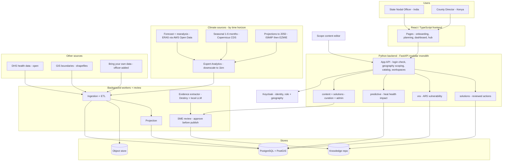

### What each component does

**React/TypeScript frontend**
- **Pages** — render onboarding, planning, dashboard, hub from the component library; no business logic; call the app API over HTTP.
- **Keycloak** — identity: role + geography, login, user approval/seeding (enforced by the app layer).

**Python backend (FastAPI modular monolith)** — one codebase, two module groups behind enforced import boundaries:
- *App/API modules* — **auth** (verify Keycloak session, read role + geography, scope every request), **workspaces**, **users**, **geographies**, **hazards/catalog**, **content + solutions curation** (the authoring/admin surface for solutions + learning content that Payload used to hold), serving the OpenAPI contract to the frontend.
- *Engine modules* — **predictive** (applies stored fitted curve to climate → RR → attributable fraction → attributable numbers, with CIs + ensemble spread; never fits); **vra** (AR5 proxy indicators, per geography; data-driven + elicited; versions each assessment; own hazard component, separate from predictive); **solutions** (serves reviewed actions, filtered by hazard/outcome/sector); **ingestion**, **review**, **shared**.

**Data plane (Dagster) + review**
- **Ingestion + ETL** — pull each source (async CDS poll or ERA5 Open Data read), land raw in object store (idempotent on hash), downscale, zonal-stats to per-district values.
- **Projection** — apply model across scenario × horizon, ensemble mean + spread, write health-impact maps.
- **Evidence extractor** — Destiny + local LLM → structured draft actions.
- **SME review** — approve/edit/reject; only approval publishes.

**Stores** — PostgreSQL + PostGIS (all config + data + district climate + app tables; one schema owned by SQLAlchemy/Alembic); object store (raw + downscaled scratch climate); knowledge repo (reviewed actions, tables in Postgres; only `reviewed` served).

**Sources** — climate three tiers (forecast ERA5/ECMWF, seasonal Copernicus, projections ISIMIP→EZMIE); Expert Analytics downscaling; DHS; GIS boundaries; bring-your-own.

---

## 3. Frontend & UI

**Frontend = React/TypeScript.** Build components in **Storybook first** (no backend, mock data), then compose into pages wired to the Python app API over HTTP. Content and analytical data both come from the app API (which serves curated content and proxies engine reads internally).

### Component inventory (from wireframes)

| Layer | Components |
|---|---|
| Primitives | `Button`, `Select`, `Pill`/`TileToggle`, `Badge`, `InfoCallout`, `VideoCard`, `StatBig` |
| Composites | `WizardStepper`, `SummaryCard`, `SelectorGrid`, `RiskMap`, `RiskLegend`, `DistrictRanking`, `PopulationGroups`, `ActionCard` |
| Layouts | `AppShell`, `WizardLayout` |
| Pages | `OnboardingWizard`, `PlanningSelector`, `Dashboard`, `LearningHub`, `Landing` |

Story hierarchy mirrors this: `primitives/ composites/ layouts/ pages/`. Components are pure functions of props; no fetch in components. Design tokens centralised in `theme/tokens.ts`, imported by app + Storybook.

### Extensibility rule — content is data, not components
- Hazard / health-domain / outcome tiles render from a catalog the app API serves, each with an `availability` flag (`available` / `coming-soon`). Adding "flooding + X" is a catalog row flip — no new component, no redeploy.
- The onboarding output (`Workspace`: country, admin level, geography, sector, collaborators) parameterises every downstream page.
- **Bring-your-own data:** an officer can register a local source through the same ingestion interface; CHART suggests which data adds most value.

> **UI/model sync:** the dashboard threshold `StatBig` must render a **geography-specific, model-derived reference percentile** (25th Kajiado, 27th MP; extreme exposure ~97th), **not** a hardcoded 35°C.

---

## 4. Engine & repository layout

**Monorepo.** One clone; a React/TypeScript frontend + a Python backend (app + engine) + Dagster, sharing the contract and deploying together.

```
chart/                              # monorepo root
├─ frontend/                        # React / TypeScript app (SPA or Next.js used as frontend only)
│  ├─ src/
│  │  ├─ pages/ (or app/)            #   public: landing, learning hub — authed: onboarding, planning, dashboard
│  │  ├─ components/                #   Storybook library: primitives/ composites/ layouts/ pages/
│  │  ├─ lib/api-client/            #   typed client GENERATED from the OpenAPI contract
│  │  └─ theme/tokens.ts            #   brand tokens — imported by app AND Storybook
│  └─ package.json
│
├─ backend/                         # Python — installable package "chart" (FastAPI modular monolith)
│  ├─ chart/
│  │  ├─ api/                       #   FastAPI app: mounts the modules below as routers
│  │  ├─ auth/                      #   Keycloak/OIDC session + role/geography claim checks
│  │  ├─ workspaces/                #   workspace CRUD (onboarding output)
│  │  ├─ users/                     #   user + role management
│  │  ├─ geographies/  hazards/     #   catalog + selector data (availability flags)
│  │  ├─ content/                   #   curated content + solution authoring/admin (was Payload)
│  │  ├─ predictive/                #   erf.py (apply fitted model), service.py
│  │  ├─ vra/                       #   composite.py, service.py
│  │  ├─ solutions/                 #   extractor.py, service.py
│  │  ├─ ingestion/                 #   adapters/ (era5_opendata, cds, dhs, worldpop…), zonal.py
│  │  ├─ review/                    #   service.py
│  │  └─ shared/                    #   db/ (SQLAlchemy + Alembic — SOLE schema owner), provenance, config
│  └─ pyproject.toml                # + import-linter contract
│
├─ orchestration/                   # Dagster data plane — IMPORTS the chart package
│  ├─ chart_pipeline/
│  │  ├─ assets/                    #   raw_climate, downscaled, district_climate,
│  │  │                             #   covariates, fitted_model (external), health_impact
│  │  ├─ resources/                 #   db, object store, climate clients — thin, call into chart.*
│  │  └─ schedules.py  sensors.py  definitions.py
│  ├─ dagster.yaml                  # run launcher (VM vs K8s) lives HERE
│  └─ pyproject.toml                # depends on ../backend
│
├─ contracts/openapi.yaml           # backend ↔ frontend seam (generates the TS client)
├─ deploy/                          # all-in-one Dockerfile + docker-compose.yml + .env.example + k8s/ (Helm)
├─ docs/                            # MkDocs Material site (see §10)
│  ├─ technical-design-document.md  #   this document — for contributors
│  ├─ deploy/                       #   operator + self-host guide — for governments
│  └─ api-reference.md              #   rendered from the OpenAPI contract, not hand-written
├─ mkdocs.yml                       # docs site config (Material theme, mermaid, openapi plugin)
├─ README.md  ·  justfile
```

### Seam rules
- **One Python backend, two module groups.** App/API modules (`auth`, `workspaces`, `users`, `geographies`, `hazards`, `content`, `solutions` API) and engine modules (`predictive`, `vra`, `ingestion`, `review`) live in the same package. `chart.api` mounts them; Dagster imports the engine modules for batch. Compute lives in the modules with **no FastAPI or Dagster imports**; routers and Dagster assets are thin wrappers.
- **The OpenAPI contract** (`contracts/openapi.yaml`) is the seam between the Python backend and the React frontend: the backend implements it, `frontend/src/lib/api-client/` is generated from it. `just contract` keeps them in sync.
- **SQLAlchemy + Alembic is the sole schema owner** — every table (app and engine) is defined and migrated in `chart/shared/db`. No second ORM owns or migrates the schema.

### Module dependency rule (import-linter, in CI)
```ini
[importlinter:contract:layers]
type = layers
layers =
    chart.api
    chart.predictive | chart.vra | chart.solutions | chart.review
    chart.ingestion
    chart.shared

[importlinter:contract:module-privacy]
type = forbidden
source_modules = chart.vra
forbidden_modules = chart.predictive.erf   # import service.py, never internals
```

### Runtime faces
- **Serving:** the FastAPI app (`chart.api`) serves the frontend's synchronous reads and writes.
- **Batch:** Dagster (`dagster-daemon` schedules, run launcher executes), calling engine functions. Replaces any job queue for the data plane.
- Default: **one backend image used two ways** (run as the API; imported by Dagster) → versions lockstep.

### Migration path (retiring Fastify into Python, strangler-style)
A Fastify/Drizzle app layer exists today. It is being replaced module-by-module by the Python app modules above, using the OpenAPI contract as the stable seam so the frontend never notices which language serves a given endpoint:
1. Stand up the Python `chart.api` alongside Fastify, both behind the same contract.
2. Move one module at a time, easiest first — `geographies`, `hazards` (read-mostly) → `workspaces`, `users`, `solutions/content` → `auth` (Keycloak/session) last.
3. For each: implement in Python, point the frontend's generated client at the Python endpoint, delete the Fastify module.
4. When the last module moves, remove Fastify + Drizzle entirely; SQLAlchemy/Alembic already owns the schema, so there is no data-layer cutover.
> Do the moves **between deliverables, not mid-feature**, and finish — a half-migrated state that keeps both stacks alive indefinitely is the failure mode to avoid.

### Model fitting → platform handoff
Fitting is **offline R work by the modeler**, one model per geography. The platform never fits. The modeler publishes the **fitted curve** (shape, lag window, reference percentile, projection source, R-code `git_ref`) into `erf_parameters` (one row per geography × outcome); Dagster tracks it as an **external asset**. `predictive/erf.py` *applies* the curve. Open DHS code + data can live in the repo as the reference implementation.

### Local development & getting started
Goal: **clone → one command → a working app with data in it.** Everything runs in containers locally (MinIO for S3, a Postgres/PostGIS container).

```bash
# first run
git clone … && cd chart
just bootstrap        # copy .env.example → .env, install deps (uv + npm), pull images
just up               # bring stack up, run migrations, seed demo data
# → http://localhost:3000  (seeded so the dashboard shows data)

# everyday
just frontend         # React dev server (hot reload)
just storybook        # component library, no backend needed
just backend          # FastAPI app (uvicorn --reload) — app API + engine
just dagster          # Dagster dev UI — materialise assets by hand
just contract         # regenerate the typed frontend client from OpenAPI
just docs             # serve the MkDocs Material site locally (live reload)
just migrate  ·  just seed
just test  ·  just lint   # pytest + ruff + mypy + import-linter ; frontend unit tests
just down
```

**`just up` starts:** Postgres+PostGIS, MinIO, Keycloak (dev realm: two roles + a test officer), the Python backend (FastAPI app API + engine), the React frontend, Dagster (webserver + daemon). Preflight gate validates config, migrations run, seed loads open DHS sample + sample climate + demo workspace. `MAIL_TRANSPORT=log` by default (no SMTP needed).

**Tooling:** `uv` (Python), `npm`/`pnpm` (frontend); `ruff` + `mypy` + `pytest` + import-linter in CI; Storybook for backend-free frontend work. Local mirrors prod: same images under Compose here, k3s/EKS there, or `k3d` locally to exercise Kubernetes. Self-hoster runs the same three commands — only `.env` differs.

---

## 5. Requirements

### Predictive modeling

| Ref | Requirement |
|---|---|
| Models | **Two separate distributed-lag models, one per geography** (Kajiado, MP) — not combined. `erf_parameters` is per-geography × per-outcome. |
| Method | Distributed-lag model capturing delayed + nonlinear effects; splines; lag window configurable per disease; **9-month lag by trimester** for LBW. |
| Threshold | Reference = **percentile of local temperature** (25th Kajiado, 27th MP); extreme exposure shown ~97th percentile. **Fixed 35°C rejected.** |
| Outputs | Exposure-response function → **relative risk → attributable fraction → attributable numbers** (case counts). Supports policy counterfactual ("cut temp 5° → LBW prevented?"). |
| Covariates | Temperature + rainfall + **air pollution** (remote sensing) + **population** (WorldPop, incl. projections). |
| Reusability | One methodology across outcomes/geographies via input swaps. New regions without local health data: estimate from national DHS or literature. **Health data is the bottleneck; climate is always available.** |
| Projection source | **ISIMIP now → EZMIE** (bias-corrected, preferred). Adapter treats dataset as swappable. Projections static once extracted. |
| Ingest | ERA5 daily granularity (monthly insufficient). Bounding boxes: whole Kenya + whole MP; extract smaller. |
| Uncertainty | Climate ensemble (5 now, up to 20–30), **equal-weighted**: mean thick line + spread. RR and attributable numbers carry CIs. No live re-fitting. |
| Display | Health impact, not raw temperature. RR + attributable fraction (primary) + attributable numbers. District map + time trends. |
| Resolution | ~50 km native; Expert Analytics downscales to 1 km / 500 m into PostGIS. Kajiado sparse — projection downscaling is an open dependency. |

### VRA
- **Functional:** assess vulnerability with **IPCC AR5** proxy indicators (exposure, sensitivity, adaptive capacity), health-systems level; mix data-driven + elicited/literature indicators; normalise, optionally compose a score; flag maladaptation; version each assessment.
- **Non-functional:** small comparable core across India + Kenya + country-specific indicators (local trust); indicators are config, not code (per-geography sets); prefer proxies over sensitive health data; **presented alongside predictive, not fed by it (MVP)**.

### Solutions repository
- Search/filter reviewed solutions by hazard, outcome, sector, WHO-GAP category.
- Extract unstructured plans/papers into structured drafts (local LLM).
- SME approves/edits/rejects each draft before publish or serve. **No unreviewed record is ever served.**

### UX / workspace
- Onboard: country → admin area → sector → workspace.
- Plan: hazard → health domain → outcome (availability-gated tiles).
- Navigate: regional map → district ranking → district detail → actions.
- Role + geography scoping server-side; modeled vs observed visually distinct; content extensible by config.

### Pipeline + human review
- Ingest climate/health/GIS/literature on schedule and on demand.
- Route every candidate record through review before publish.
- Idempotent on source hash; per-source isolation. Open data stored freely; restricted data as scripts/outputs only.

### Documentation
- **Functional:** publish one docs site (MkDocs + Material) covering system design (contributors) and deployment/operation (self-hosting governments); ship an **operator deployment guide** with a runnable path per target — local (a single all-in-one demo image *and* `docker compose up` with bring-your-own-database), AWS (reference), other clouds (Azure/GCP), Kubernetes at scale; API reference **generated from the OpenAPI contract**, never hand-written.
- **Non-functional:** CI fails if the contract, generated client, or docs site drift from code; deploy docs reference the *actual* `deploy/` artifacts and CI smoke-tests `compose up` health so they can't drift; internal-API interactive docs (Swagger/ReDoc) cluster-internal only; docs versioned per release, built in CI like the app.

---

## 6. Data flows

Each flow lists the entities it touches: **C**reate · **R**ead · **U**pdate · **A**sset/store · **×** not persisted.

### 6.1 Model fitting (offline, in R, by the modeler)
Not part of the running app. CHART receives and stores the fitted curve; never fits.
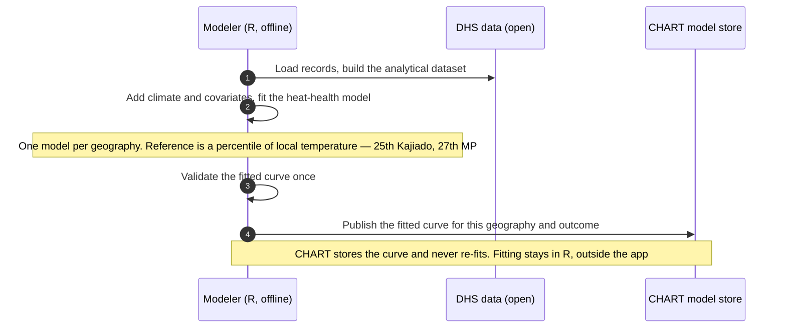
Entities: **C** `ERF_PARAMETERS` · **×** fitting happens in R, not in CHART's stores.

### 6.2 Climate ingestion & zonal aggregation (batch)
Two adapter shapes behind one interface. **ERA5 via AWS Open Data** = direct partial read from S3 (Zarr, no ticket/poll, free egress in-region, raw already durable so no re-landing). **Seasonal & projections via CDS** = async submit→poll→download→land raw (why *that* path never sits on a user request). Both converge at zonal stats.
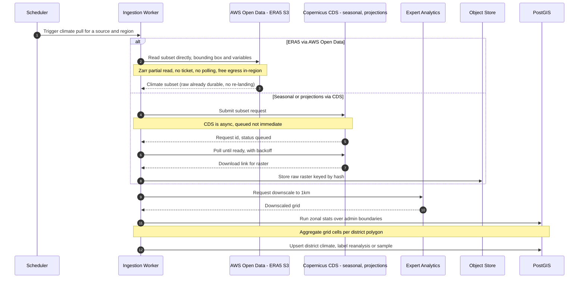
Entities: **R** `ADMIN_UNIT` · **CU** `CLIMATE_RUN`, `DISTRICT_CLIMATE` · **A** raw raster → object store (CDS path only; Open Data is read-through).
**Caveats:** verify the Open Data ERA5 matches the modeler's source (variables, resolution, version — diff a slice); run ingestion compute in the bucket's region to keep egress free; self-hosters reading Open Data from their own hardware pay normal internet egress.

### 6.3 Health-impact projection (batch)
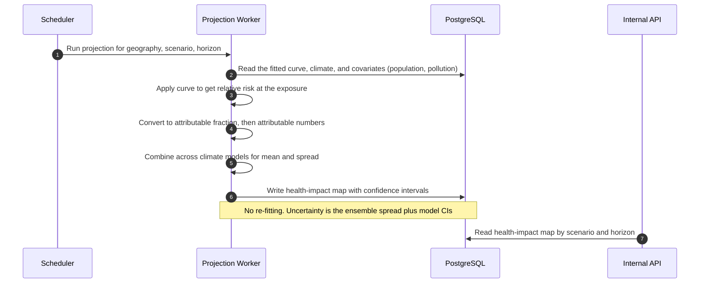
Entities: **R** `ERF_PARAMETERS`, `CLIMATE_RUN`/`DISTRICT_CLIMATE`, `COVARIATE` · **C** `HEALTH_IMPACT`, `PROVENANCE`.
No fallback: a geography either has a fitted curve or shows "not available yet".

### 6.4 VRA assessment (parallel to predictive)
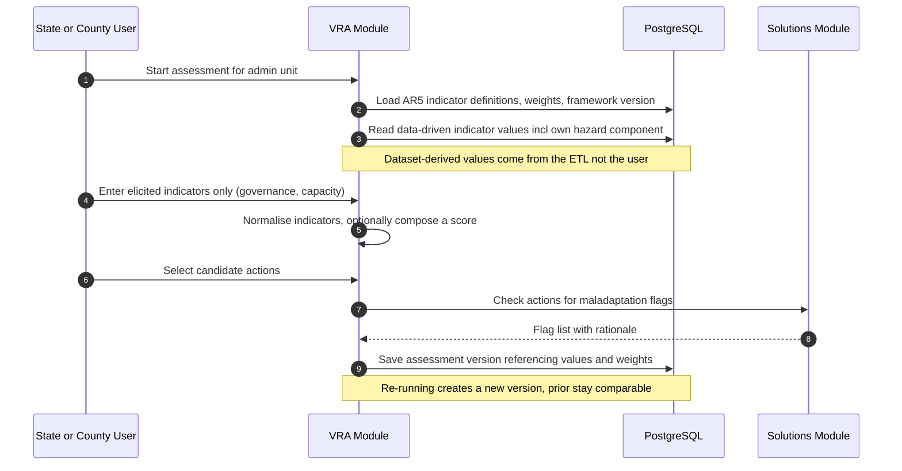
Entities: **R** `INDICATOR_DEFINITION`, `INDICATOR_WEIGHT`, `INDICATOR_VALUE`, `SOLUTION` · **C** `VRA_ASSESSMENT`, elicited `INDICATOR_VALUE`.

### 6.5 Solutions ingestion through the human-review step
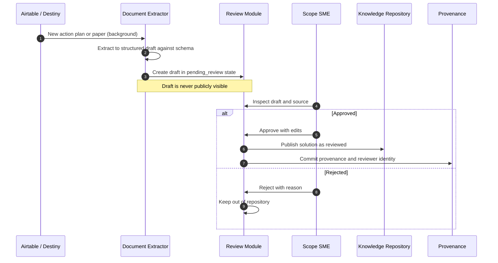
Entities: **C** `SOLUTION` (draft), `REVIEW_EVENT`, `PROVENANCE` · **U** `SOLUTION.status`.

### 6.6 User request (read-only, per click)
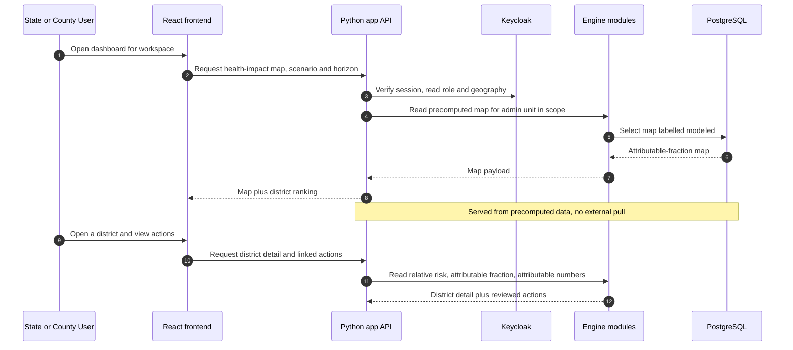
Entities: **R** `WORKSPACE`, `HEALTH_IMPACT`, `ADMIN_UNIT`, `SOLUTION` · **×** no writes.

---

## 7. Data model

Anchored on `admin_unit` (geographic spine) and `provenance` (every ingested artefact). **Config** (`indicator_definition`, `indicator_weight`, `erf_parameters`) separate from **data** (`indicator_value`, `health_impact`, `covariate`, `district_climate`). Raw microdata absent by design. Curated content (learning videos, pages) lives in a `content` table owned by the app layer, in the same SQLAlchemy-managed schema.

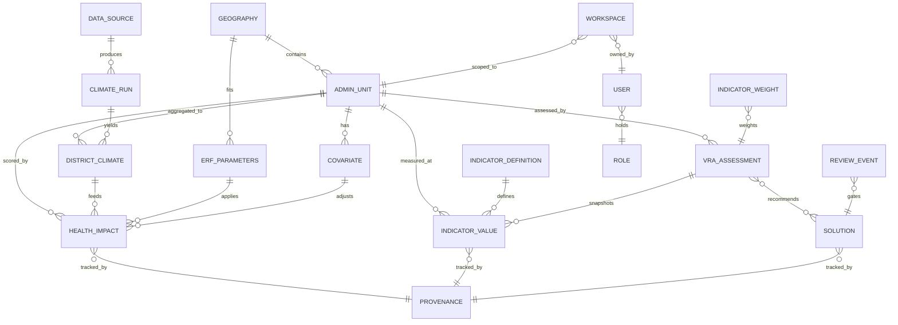

> The diagram above renders on GitHub or any Mermaid-aware viewer. In a plain markdown preview it shows as code — the same relationships are tabulated below so nothing is lost.

### Relationships

| Parent | Cardinality | Child | Meaning |
|---|---|---|---|
| `geography` | 1 → many | `admin_unit` | a geography contains many admin units |
| `geography` | 1 → many | `erf_parameters` | one fitted model per geography × outcome |
| `data_source` | 1 → many | `climate_run` | a source produces many climate runs |
| `climate_run` | 1 → many | `district_climate` | a run yields per-district aggregates |
| `admin_unit` | 1 → many | `district_climate` | each district has aggregated climate values |
| `admin_unit` | 1 → many | `covariate` | population, pollution per district |
| `admin_unit` | 1 → many | `health_impact` | scored per scenario × horizon |
| `admin_unit` | 1 → many | `indicator_value` | VRA indicator values per district |
| `admin_unit` | 1 → many | `vra_assessment` | assessments per district (versioned) |
| `district_climate` | many → 1 | `health_impact` | climate feeds the projection |
| `erf_parameters` | 1 → many | `health_impact` | the fitted curve is applied |
| `covariate` | many → 1 | `health_impact` | covariates adjust the projection |
| `indicator_definition` | 1 → many | `indicator_value` | defines what each value measures |
| `indicator_weight` | many → 1 | `vra_assessment` | weights applied in an assessment |
| `vra_assessment` | 1 → many | `indicator_value` | snapshots the values it used |
| `vra_assessment` | many ↔ many | `solution` | recommends candidate actions |
| `review_event` | many → 1 | `solution` | gates publish (only approval serves) |
| `solution` | many → 1 | `provenance` | source + license tracked |
| `health_impact` | many → 1 | `provenance` | source + climate run tracked |
| `indicator_value` | many → 1 | `provenance` | source tracked |
| `workspace` | many → 1 | `user` | owned by a user |
| `workspace` | many → 1 | `admin_unit` | scoped to a geography |
| `user` | many → 1 | `role` | holds a role (+ geography claim) |

### Key entities & fields

| Entity | Fields (types) | Notes |
|---|---|---|
| `data_source` | id, name, kind, cadence, geography_id, user_added(bool), last_refreshed_at | Registry of built-in + user-added sources. `cadence`+`last_refreshed_at` drive refresh; `user_added` = BYO hook. |
| `prediction_request` | id, request_key, geography, timeframe, request_payload, status, stage, dagster_run_id, climate_run_id, result_payload, error_code | Durable API-to-Dagster handoff. `request_key` coalesces duplicate user requests; completed R results remain queryable. |
| `geography` | id, country, name | Kajiado, MP. |
| `admin_unit` | id, geography_id, level, code, boundary `geometry(MultiPolygon,4326)` | Spatial spine; spatial index for zonal stats. |
| `climate_run` | id, data_source_id, tier, input_hash(SHA-256), scenario, resolution, data_label | `input_hash` = idempotency + reproducibility. |
| `district_climate` | id, admin_unit_id, climate_run_id, variable, value, agg_method | Zonal-stats output; read by predictive + VRA. `agg_method` = area-weighted mean vs centroid (**open**). |
| `erf_parameters` | id, geography_id, outcome, spline_coefficients(jsonb), lag_window(jsonb), ref_percentile, projection_source, git_ref | One row per geography × outcome; reference is a percentile. |
| `health_impact` | id, admin_unit_id, scenario, horizon, relative_risk_milli, rr_ci_low_milli, rr_ci_high_milli, attributable_frac_milli, attributable_number, ensemble_spread_milli, data_label | Grain: (admin_unit, scenario, horizon). Integers ×1000 (milli), no floats on public-facing numbers. `attributable_number` = case count. |
| `covariate` | id, admin_unit_id, kind, value, data_label | pollution, population. |
| `indicator_definition` | id, code, domain, source_dataset, direction, normalise_method | AR5 indicators, config not code, per-geography sets. |
| `indicator_value` | id, admin_unit_id, indicator_code, value, normalised_milli, data_label | Data-driven + elicited. |
| `indicator_weight` | id, domain, weight_milli, framework_version | Per-domain or per-indicator (**open**). |
| `vra_assessment` | id, admin_unit_id, framework_version, version, composite_milli | Versioned; re-run creates new version. |
| `solution` | id, title, hazard, outcome, status(`pending_review`/`reviewed`/`rejected`) | Only `reviewed` served; only a `review_event` sets it. |
| `review_event` | id, solution_id, reviewer, decision, reason, at | Audit trail. |
| `workspace` | id, country, admin_level, sectors(jsonb) | Onboarding output; parameterises pages. |
| `user` | id, keycloak_sub | Identity via Keycloak. |
| `role` | id, name | e.g. State Nodal Officer, County Director. |
| `provenance` | id, source_uri, git_commit, license | On every ingested artefact. |

`data_label` enum: `modeled` / `observed` / `reanalysis` / `sample`.

---

## 8. API surface

One Python backend, two route groups. **App API** — public, Keycloak-scoped routes the React frontend calls (auth, workspaces, catalog, content, analytical reads). **Engine calls** — the app modules call the engine modules **in-process** (same monolith, not over a network); the routes below marked *engine/admin* are private, admin-only, and not exposed to the public. The OpenAPI contract generates the frontend's typed client.

### App API — auth & workspace
| Method | Path | Purpose |
|---|---|---|
| GET | `/api/auth/me` | Current user, role, geography claims. |
| GET | `/api/geographies` · `/api/geographies/:country/admin-levels` | Onboarding options. |
| POST | `/api/workspaces` | Persist onboarding result. |
| PATCH | `/api/workspaces/:id` | Edit workspace. |

### App API — catalog & content
| Method | Path | Purpose |
|---|---|---|
| GET | `/api/catalog/hazards` · `/health-domains` · `/outcomes` | Selector tiles with `availability` flags. |
| GET | `/api/content/learning-hub` · `/api/content/pages/:slug` | App-managed curated content. |

### App API — analytical reads (served by the engine modules in-process)
| Method | Path | Purpose |
|---|---|---|
| GET | `/api/risk/:geo/map?outcome=&scenario=&horizon=` | Health-impact choropleth (attributable fraction by district). |
| GET | `/api/risk/:geo/districts?outcome=&scenario=&horizon=` | District ranking + time trend. |
| GET | `/api/districts/:id?outcome=&scenario=&horizon=` | RR, attributable fraction, attributable numbers, each with CIs. |
| GET | `/api/solutions?hazard=&outcome=&sector=` | Reviewed actions only. |
| POST | `/api/vra/:adminUnit/assessments` | Create a VRA assessment version. |

### Engine / admin routes (private, not public)
| Method | Path | Purpose |
|---|---|---|
| POST | `/internal/models` | Publish a fitted curve for a geography + outcome (modeler handoff). CHART never fits. |
| GET | `/internal/admin-units/:id/health-impact?outcome=&scenario=&horizon=` | Precomputed projection (RR, attr. fraction, attr. numbers, CIs). |
| GET | `/internal/admin-units/:id/vra` | Precomputed VRA result (normalised AR5 indicators + composite if used). |
| POST | `/internal/ingestion-runs` · `/internal/projection-runs` | Trigger batch jobs (idempotent on hash); admin only. |
| POST | `/internal/review/drafts/:id/decision` | The only path that publishes a solution. |

> **API docs are generated, never written.** Source of truth is `contracts/openapi.yaml`. FastAPI serves Swagger/ReDoc for internal devs (cluster-internal only, never public). The published reference in the docs site (§10) renders from the same contract. CI fails on any drift between the backend, the contract, and the generated frontend client.

---

## 9. Technology & infrastructure

| Layer | Choice | Why |
|---|---|---|
| Frontend | React / TypeScript (Storybook) | UI only; calls the Python API over HTTP; shared types via the generated client. |
| Component workshop | Storybook + MapLibre GL | Isolated components; open self-hostable map tiles. |
| Backend (app + engine) | Python FastAPI, one modular monolith (SQLAlchemy 2.0) | App/API layer + engine as modules in one process; import-linter seams; one language removes the TS↔Python contract + dual-ORM overhead. |
| Content + curation | App-layer module (was Payload) | Content/solution authoring lives in the Python app, not a separate Next.js-native CMS. |
| Auth | Keycloak (OIDC) | Role + geography claims, enforced by the app layer on every request; editors are role-gated. |
| Engine | Modules within the backend | predictive/VRA/solutions/ingestion; import-linter seams for a later split. |
| Datastore | PostgreSQL + PostGIS (SQLAlchemy 2.0, Alembic) | Relational + spatial + JSONB in one; zonal stats in PostGIS. |
| Object store | S3-compatible (MinIO self-host) | Swappable raster/tile landing. |
| Data plane / jobs | Dagster — assets, partitions, schedules, freshness | Partitioned (geo × scenario × horizon) with lineage + backfills. Compute stays in engine. |
| Climate ingest | Copernicus CDS async client; Expert Analytics downscale | CDS is submit→poll→download; a Dagster asset, never on a request. |
| Extraction | Local LLM (~8B) for document extraction | Sensitive docs on-prem; output is a draft caught by SME review. |
| Tooling | uv, ruff, mypy, pytest; pydantic-settings | Fast, typed; config from env, no secrets in code. |
| Deploy | Containers: Compose on VPS → k3s → EKS | Same images across tiers. |
| License | AGPL-3.0 | Network-copyleft keeps hosted forks open. |

### Deployment topology (Scope-hosted reference: k3s on one EC2)
Principle: **swappable storage (S3 + Postgres); compute is the only real choice.**

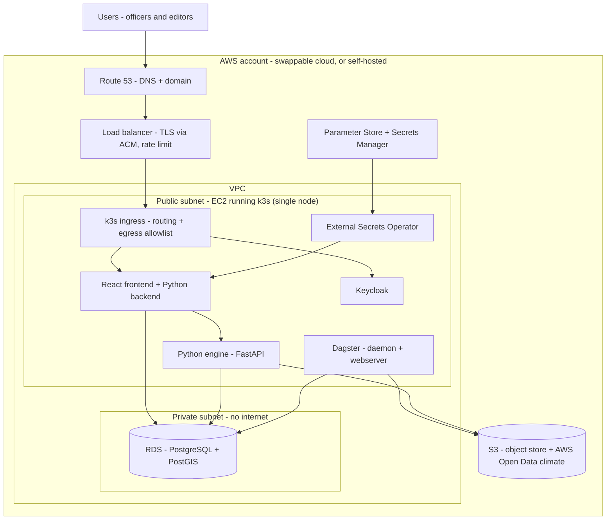

- App in **public subnet** behind ALB (TLS via free auto-rotating ACM cert, rate-limit). DB in **private subnet**, reachable only via security group — never internet-exposed.
- **k3s now, EKS later:** EKS bills ~€45/mo control plane + per-GB NAT gateway — enterprise tax for scale the MVP lacks. k3s on one EC2 gives orchestration, GitOps, TLS rotation, and **per-namespace egress allowlist** (a compromised container can't exfiltrate secrets) cheaply. Switch to EKS when >2 instances or a paying customer needs managed hosting.
- **AWS Open Data:** ERA5/Copernicus is free to download there — but (1) verify same variables/resolution/version by diffing a slice; (2) it's a per-source fast path, ISIMIP/IMD still need their own adapters.

### Deployment tiers (same containers)
| Tier | Orchestration | When |
|---|---|---|
| Local dev | Docker Compose or k3d | development, evaluation |
| Scope-hosted MVP | k3s on single EC2 | now — tens of users |
| Managed / scale | EKS, multi-node | >2 instances or paying customer |
| Government self-host | their own VM or cluster | data sovereignty |

### Two ways to get it running
CHART is several containers (app, engine, Dagster, Keycloak) + Postgres + object store, so two documented entry points:
- **Single all-in-one image (try / evaluate):** one image bundling every service — `docker run` and click around in minutes, no Compose, no cloud. *Evaluation only* — no independent scaling, data ephemeral unless a volume is mounted; a deliberate extra build (combined `Dockerfile` in `deploy/`) kept because a five-minute eval path matters for adoption.
- **`docker compose up` with prebuilt images (real local / small self-host):** the honest multi-container shape, each service its own container, published to the registry. Bring your own Postgres/object store via `.env` or use the bundled ones. Same Compose file the dev workflow uses.

> **Deploy artifacts are the docs' source of truth.** `deploy/` holds the real combined `Dockerfile`, `docker-compose.yml`, and `k8s/` Helm charts the operator guide (§10) points at; CI smoke-tests that `compose up` reaches healthy preflight, so "how to deploy" can't drift from what ships.

### Delivery: GitOps pull model + secrets
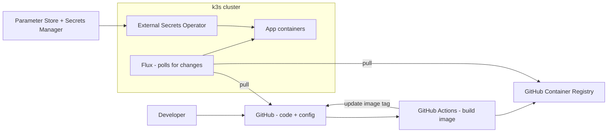
**Pull, not push:** CI builds → pushes image to GHCR → updates config tag; Flux inside the cluster pulls. GitHub never gets access into the cluster. Sandbox and production are separate accounts/paths with a promote step. Secrets: Parameter Store (manual, cheap — tokens) + Secrets Manager (auto-rotate — RDS password), synced by External Secrets Operator. No secret in the repo.

---

## 10. Cross-cutting concerns

- **Security:** Keycloak role + geography claims enforced by the app layer on every route; engine module queries geography-scoped. Open DHS stored freely; restricted data as scripts/outputs only. TLS in transit, encryption at rest, secrets from env. Engine/admin routes private. k3s per-namespace egress allowlist.
- **Scalability:** small (two geographies, monthly-ish cadence, precomputed reads). The backend scales as a web tier; the engine's heavy batch (zonal stats, projection) scales by adding worker instances. No sharding, no broker.
- **Cost:** floor is one VPS + storage; self-hostable. Variable cost at the edge (CDS/EA egress) rate-limited. AWS Open Data softens climate egress.
- **Observability:** correlation id per ingest/score/projection/review; per-source job success/failure; audit trail of review decisions. Headline signal: **last successful run per source**.
- **Resilience:** CDS async submit→poll→download, backoff; persistent failure keeps last-good map and shows "not available yet" (no fabricated proxy). Idempotent on `input_hash`, per-source isolation. Extractor produces drafts only. The frontend serves last-good cached reads on a brief backend blip; writes fail closed.

### Data plane & orchestration (Dagster)
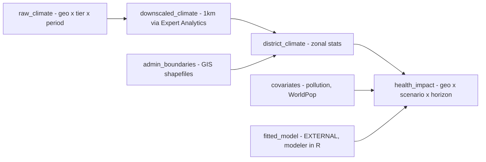
- `health_impact` is a **multi-dimensional partitioned asset** (geo × scenario × horizon) — new climate re-materializes only affected partitions. Lineage = provenance, free.
- `fitted_model` is an **external asset** (produced in R); publishing a new one marks downstream `health_impact` stale.
- **Refresh modes:** projections static (materialize once); climate monthly (schedule / freshness policy); on-demand prediction (app writes a durable Postgres request, a Dagster sensor launches one idempotent job, and the job pulls only missing climate data).
- **Same scheduler, different job shape by source:** only the `raw_climate` adapter differs — ERA5 is a bounded direct read from AWS Open Data (no waiting state), seasonal/projections use the async CDS poll. One-adapter swap, not a pipeline change; asset graph, partitions, freshness identical.

> **Why keep an orchestrator (decided):** the pipeline has real DAG structure (pull → downscale → zonal → project, partitioned by geography × scenario × horizon, fitted model as external input), so backfills and freshness tracking come free rather than hand-built. Cost is two long-lived services (webserver + daemon) to run/secure — accepted; that batch work is what an orchestrator is for. Revisit only if the pipeline shrinks to a single trivial step. Compute stays in the engine, so this is a wrapper choice, not lock-in.
- **VM vs K8s = run launcher only** (`dagster.yaml`): VM = local/multiprocess; K8s = `K8sRunLauncher` + `k8s_job_executor` (per-run/step pods). Same asset code. k3s is a K8s flavour, so on a single node stay on the simple launcher; per-run pods at EKS.

### Documentation & API reference (MkDocs Material, generated, CI-guarded)
For a DPG the docs are part of the product — governments read them before running anything — so they're built and tested like code. One site, two audiences: contributor/system-design docs (this doc) + operator/self-host docs. Tool: **MkDocs + Material** (Python, markdown-native, Mermaid, search, per-release versioning).

**Generated, never hand-written:** the API reference is produced from `contracts/openapi.yaml`. FastAPI serves Swagger/ReDoc for internal devs (cluster-internal only); the published reference renders from the same contract. The contract is the single source of truth for the backend, the generated frontend client, and the docs.

**CI checks on every PR:**

| CI check | Guarantees |
|---|---|
| Validate the OpenAPI contract (spec lint) | contract is well-formed |
| Generate OpenAPI from the FastAPI app, diff vs committed contract | engine implements what the contract promises — fail on drift |
| Regenerate the typed frontend client from the contract, assert no diff | frontend client never stale against the API |
| Build MkDocs with `--strict` | no broken nav, missing pages, dead internal links |
| Link-check external references | operator/deploy docs don't rot |

On merge to `main`, CI publishes the site (Read the Docs or static behind the load balancer) — same GitOps discipline as the app. Net: a change not reflected in the contract + docs **fails the build**, so the reference can't drift. Build work: `mkdocs.yml` + `docs/` tree (§4), an OpenAPI-render plugin, a `just docs` target, and the CI job above.

### Operator & deployment guide (what the docs must cover)
"How do I run this?" asked at four levels. The docs carry a runnable, tested path for each — local + AWS as MVP musts, the portability rungs documented-as-supported and built when a real deployer needs them (adopt-when-demanded, as with EKS).

| Rung | What the deployer does | Artifact | Priority |
|---|---|---|---|
| Try / evaluate | Pull the single all-in-one image, `docker run`, click around in minutes | combined `Dockerfile` | **MVP must** |
| Local / small self-host | `docker compose up` with prebuilt images; connect own Postgres/object store via `.env` | `docker-compose.yml` | **MVP must** |
| AWS (reference) | k3s on EC2 + RDS + S3 + GitOps, step by step (§9 topology) | `k8s/` Helm + guide | **MVP must** |
| Other cloud (Azure, GCP) | Same contract — a Postgres, an S3-compatible bucket, a container host; AWS is the worked example, this documents the mapping | portability notes + Helm | documented; built when needed |
| Kubernetes at scale | Helm into a real cluster; Dagster K8s run launcher (per-run pods); scale engine workers for many geographies | `k8s/` Helm + values | documented; built when needed |

This ladder is what the swappable-storage contract and "same containers everywhere" were *for*: nothing in the app is AWS-specific, only the wrapper changes. All-in-one image + Compose cover "try it" and "run it small"; the Helm charts cover AWS, other clouds, and scale from one set of manifests.

---

## 11. Startup & self-host resilience

Principle: **fail loud, fail early, fail with a fix.** Preflight gate before the app serves traffic.

**Required (refuse to start):** Postgres + PostGIS, object store, Keycloak, DB migration state.
**Optional (degrade + warn):** email (→ `log` mode), climate API credentials (ingestion disabled), Expert Analytics / RAG.

```
[ ok ] config schema valid
[ ok ] database reachable, PostGIS present
[ ok ] migrations current (head)
[ ok ] object store bucket reachable
[ ok ] keycloak discovery reachable
[warn] MAIL_TRANSPORT=smtp but SMTP_HOST unset — falling back to 'log'
[fail] DATABASE_URL is not set. Copy .env.example → .env. See docs/deploy.md#database.
       → refusing to start
```

- Config validated against a typed schema (pydantic-settings / env schema) before anything else.
- Migrations gated: current → proceed; behind → migrate-and-log or refuse; ahead → refuse (downgrade hazard). `AUTO_MIGRATE` config flag (auto for self-host, manual for Scope prod).
- Fatal failure → non-zero exit (container fails fast). Degraded → boot banner + `/health` (liveness) and `/health/ready` (all required deps green).
- **Email:** `MAIL_TRANSPORT=smtp|log|disabled`. Default `log` (open-source). Scope sets `smtp` with a provider (Mailgun/SES/Brevo — plain SMTP, no lock-in) via env secrets. Every email flow has a defined off-behaviour (approval flips status silently, reset admin-mediated). Invites are signed links email merely delivers.

---

## 12. Risks & open questions

| Severity | Item | Impact / handling |
|---|---|---|
| HIGH | Can Expert Analytics downscale **projections**, not just historical? | If not, projection can't reach 1 km; Kajiado too coarse. Decides Kenya viability. |
| HIGH | Model-handoff grain (geography level + temporal granularity) | Sets `climate_run` input + `health_impact` output shape. Hakim ↔ McQueens. |
| HIGH | **Scenario & source alignment** predictive vs VRA | Predictive = ISIMIP/CMIP under **SSP**; VRA hazard = **IMD** under **RCP 4.5/8.5**. Different frameworks/sources risk inconsistent climate stories. CEEW (Vanya) to confirm. |
| HIGH | Legal data-processing entity (Scope vs government) | One source interface supports both. Build proceeds while legal resolves. |
| HIGH | **Zonal aggregation method** (`district_climate.agg_method`) | Area-weighted mean vs centroid vs interpolation, at what resolution. McQueens can answer from R code. Blocks `zonal.py`. |
| MED | VRA ↔ predictive integration | Presented **separately** for MVP (CEEW position); full fusion beyond this year. |
| MED | VRA methodology (CEEW-owned, pending) | Chosen: IPCC AR5, country-specific indicators. Open: spatial scale, static vs dynamic, composite vs normalisation, Delphi vs PCA weighting. |
| MED | Policy counterfactual ("cut temp 5° → LBW prevented") | Scoped deferred, but McQueens frames as natural ERF output. Confirm MVP vs later. |
| MED | Projection source ISIMIP → EZMIE | Adapter treats dataset as swappable. |
| MED | Score semantics per surface | RR / attributable fraction / attributable numbers all have CIs. Pick the headline per UI surface. |
| MED | Risk formula multiplicative (H×E×V) vs additive | Materially different numbers. |
| LOW | AWS Open Data equivalence for ERA5 | Diff a slice vs the modeler's source before switching to the free-egress path. |
| LOW | Reference temperature, SSP medium pairing, animation need | Confirm; none block architecture. |


**Out of scope (MVP):** public hosting of raw microdata (only outputs/parameters persist); intervention-impact "act and risk drops by X" layer; outcomes beyond LBW/infant mortality; flooding beyond a selector stub.

---

## 13. Suggested build order

A pragmatic sequence to get from empty repo to a demoable MVP:

1. **Scaffolding & tooling** — monorepo layout, `justfile`, `docker-compose.yml` (Postgres/PostGIS, MinIO, Keycloak), `.env.example`, preflight gate, `just up` bringing up an empty-but-healthy stack. Stand up the **MkDocs Material site** (`mkdocs.yml` + `docs/`) and the CI drift checks (§10) early, so docs and API reference are generated-and-guarded from commit one.
2. **Data model + migrations** — SQLAlchemy models in `chart/shared/db`, Alembic migrations, the entities in §7. Seed script (open DHS sample, GIS boundaries, demo workspace).
3. **Backend skeleton + OpenAPI contract** — FastAPI `chart/api` mounting the app modules, the endpoints in §8, `contracts/openapi.yaml`, generate the frontend client.
4. **Frontend component library in Storybook** — the §3 components against mock data; tokens; no backend needed. Runs in parallel with 2–3.
5. **Ingestion (one climate tier first)** — `ingestion/adapters/` (ERA5 Open Data read, or CDS async submit→poll→download), `zonal.py` (after the aggregation-method decision), landing raw in MinIO + `district_climate`. Wrap as a Dagster asset.
6. **Predictive apply-path** — `predictive/erf.py` applying a published fitted curve (use McQueens' reference model + MP DHS data) → `health_impact`. The `POST /internal/models` handoff.
7. **Frontend + app-API wiring** — React pages consume the generated client; Keycloak session + geography scoping enforced in the app layer; the dashboard reads precomputed maps (§6.6).
8. **Content + solutions + review** — the app `content`/`solutions` modules, the extractor draft path, SME review gate, serve reviewed actions.
9. **VRA module** — once CEEW confirms indicators/methodology; parallel output on the dashboard.
10. **Deploy** — Compose → k3s on EC2 with GitOps (Flux) + External Secrets, per §9.

> Start where the value + certainty are highest: **1 → 2 → 3 → 6** gets a real health-impact number on screen for MP (the showcase spine). VRA (9) waits on CEEW; ingestion (5) waits on the zonal-aggregation answer — both can be stubbed with seeded data meanwhile. If a Fastify app already exists, treat step 3 as the start of the strangler migration (§4) rather than a greenfield build.
