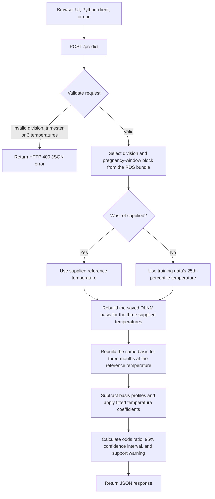

# LBW × maximum-temperature association — direct inference demo

This is a small browser/API wrapper around an already fitted R Distributed Lag
Non-linear Model (DLNM). It estimates a **conditional odds ratio for low birth
weight (LBW)** for a three-month temperature profile relative to a reference
temperature profile. The three values can come from a seasonal forecast,
observations, or a climate projection.

It does **not** download weather, run a forecast, create climate scenarios, or
calculate an individual baby's probability of LBW. The user supplies the three
exposure values and the saved R model performs the association calculation.

## What is included

```text
model/MP_division_LBW_tmax_DHS2015-21_v1.0.0.rds
    Local fitted model bundle: 10 Madhya Pradesh divisions × 3 pregnancy windows

inference/predict.R
    Direct CLI inference from three manually supplied exposure values

inference/api.R
    Plumber API and same-origin static UI server

web/index.html
    Direct-input browser UI; it has no synthetic climate scenarios

client/query.py
    Small Python client using only the standard library
```

The RDS is the only data file needed by the inference service. It contains the
fitted temperature cross-bases, model coefficients, covariance matrices, and
model-specific training information. It does not refit the model. It is
ignored by Git and is downloaded from private S3 for EC2 deployment.

## How a prediction works



The service compares the supplied three-month temperature profile with a flat
three-month reference profile. It uses the fitted temperature terms only; it
does not refit the model or calculate an individual baby's risk.

## Exposure definition

The API requires exactly three values in Celsius:

```json
"tmax_lag": [37.2, 36.8, 35.4]
```

They are calendar-month means of **daily maximum 2 m temperature**, ordered:

```text
lag 0: latest month / closest to birth
lag 1: one month earlier
lag 2: two months earlier
```

The `trimester` is a model-window identifier:

```text
1: latest / last pregnancy window (T3)
2: middle window (T2)
3: earliest / first window (T1)
```

### Pregnancy period versus temperature source

These are separate choices in the UI:

- **Pregnancy period** chooses one of the model's fitted three-month windows:
  first (T1), middle (T2), or last (T3) pregnancy period.
- **Temperature source** explains where the three user-entered monthly values
  came from. It does not alter, generate, or fetch them.

Short-term weather outlooks (about 1–15 days) can help update one part of the
three-month profile, but they are not a replacement for the full three values.
Seasonal outlooks (about 1–6 months) are usually the natural match for a full
three-month period. Long-term climate projections provide values for future
years; they are not weather forecasts.

Before integrating a weather or climate source, confirm that its calendar
window matches the study's original birth-date exposure construction.

## Run locally

Requires R 4.0+ and Python 3.6+.

```bash
cd LBW_demo
bash setup.sh
bash run_api.sh
```

Open [http://127.0.0.1:8000/ui/](http://127.0.0.1:8000/ui/). Enter the three
temperature values directly; no defaults or climate scenarios are generated by
the app.

## Command line

```bash
Rscript inference/predict.R \
  --model model/MP_division_LBW_tmax_DHS2015-21_v1.0.0.rds \
  --division Gwalior \
  --trimester 1 \
  --tmax "38,37,35" \
  --ref 28
```

Or run the four smoke tests:

```bash
bash run_cli.sh
```

## API

```bash
curl -s -X POST http://127.0.0.1:8000/predict \
  -H 'Content-Type: application/json' \
  -d '{
    "division": "Gwalior",
    "trimester": 1,
    "tmax_lag": [38, 37, 35],
    "ref": 28
  }'
```

Important endpoints:

| Method | Path | Purpose |
|---|---|---|
| `GET` | `/health` | readiness check and model name |
| `GET` | `/divisions` | accepted division names |
| `POST` | `/predict` | direct temperature-association estimate |
| `GET` | `/ui/` | browser UI |

A successful prediction returns `odds_ratio`, `ci95_low`, `ci95_high`, the
division/window-specific modelled temperature range, and
`on_training_support`. Values outside the stored B-spline boundaries are
returned with an explicit extrapolation warning.

## Interpretation and limitations

- The output is an odds ratio conditional on the fitted observational model;
  it is not an individual probability, diagnosis, or causal estimate.
- A value above one means higher modelled odds than the selected reference
  exposure; it does not by itself establish a clinically meaningful change.
- The displayed confidence interval represents model-estimation uncertainty.
  It does not include uncertainty from climate data, spatial aggregation,
  future scenarios, or unmeasured confounding.
- Do not interpret values outside the reported modelled temperature range as
  reliable. The app labels those as extrapolated.

## Connecting real climate inputs

Climate processing must run outside the request path. Do not invoke a download
or a Python subprocess from `/predict`.

```text
Scheduled data job
  → retrieve and validate source data
  → spatially aggregate to the selected division
  → calculate monthly mean daily maxima
  → write versioned division/month exposure values
  → UI/API reads the prepared three values
  → POST /predict
```

Use a weather forecast for truly short lead times, a bias-corrected seasonal
forecast for seasonal work, and a compatible bias-adjusted climate-projection
dataset for long-term scenarios. Those are distinct products and should not be
presented as interchangeable or calculated when a user presses the button.

## Container deployment

For a local Docker test, set the model S3 URI and make AWS credentials available
to Docker:

```bash
docker build -t lbw-temperature-demo .
docker run --rm -p 8000:8000 \
  -e LBW_MODEL_S3_URI=s3://YOUR_PRIVATE_BUCKET/lbw-models/MP_division_LBW_tmax_DHS2015-21_v1.0.0.rds \
  -v "$HOME/.aws:/root/.aws:ro" \
  lbw-temperature-demo
```

For the CHART EC2 deployment—including the required IAM policy, persistent S3
configuration, push trigger, and verification steps—see [DEPLOY.md](DEPLOY.md).
