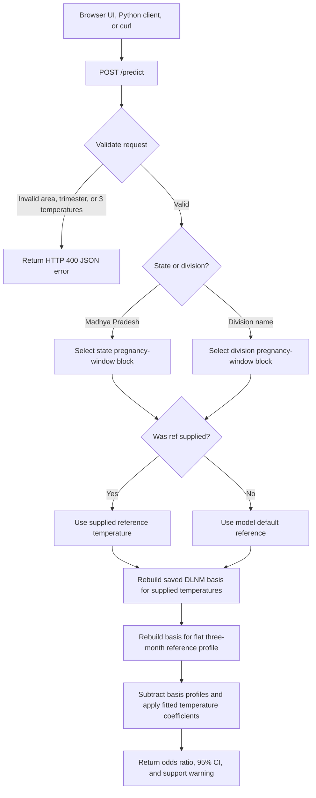

# LBW × maximum-temperature association — direct inference demo

## Model integration records

- [Kenya LBW model integration record](KENYA_MODEL_INTEGRATION.md) documents the
  recovered modelling artifacts, proposed CHART contract and configuration,
  known model gaps, and modeller approval checklist. The Kenya review artifact
  is runnable but is not approved or active.

## Release-aware compact runtime

Kenya and Madhya Pradesh can now use the same compact runtime. It starts with no
model selected, accepts verified artifacts through an internal load endpoint,
and requires every prediction to name the exact release ID, filename, version,
and SHA-256. Model identity is therefore registry data, not environment
configuration.

Tracked release records:

| Manifest                               | Artifact produced locally                    | Coverage                                           | State                     |
| -------------------------------------- | -------------------------------------------- | -------------------------------------------------- | ------------------------- |
| `model-release.kenya.review.json`      | `KE_climate_zone_LBW_tmax_v0.1.0-review.rds` | 5 climate-zone models; Kajiado review mapping only | review, inactive          |
| `model-release.mp.compact.review.json` | `IN_MP_LBW_tmax_v1.0.0-compact.rds`          | MP state + 10 divisions                            | parity review, inactive   |
| `model-release.example.json`           | two legacy MP artifacts                      | MP state + 10 divisions                            | current legacy deployment |

The compact artifacts are ignored by Git. They contain basis settings,
temperature coefficients, covariance matrices, reference temperatures,
training support, and aggregate counts only. They do not contain fitted GLMs,
respondent rows, household IDs, coordinates, or model frames.

### Verified results

- Kenya: exact rounded parity for all 15 source blocks (5 zones × 3 windows).
- MP: exact rounded parity for all 33 source blocks (state + 10 divisions,
  each with 3 windows).
- One runtime loaded both artifacts simultaneously and returned release-pinned
  predictions through the Python inference gateway.
- The generated MP compact artifact is deterministic and is about 20 KB rather
  than the roughly 155 MB combined legacy files.

The MP state release still validates only pregnancy window 1. Packaging all
three source blocks proves technical parity; it does not grant scientific
approval to windows 2 and 3.

### Build and validate the compact artifacts

Kenya requires the recovered source path described in
`KENYA_MODEL_INTEGRATION.md`:

```bash
Rscript inference/package_kenya_model.R \
  /path/to/Dlnm_Mod_obj_by_sem_and_Climate_Regions_KE_2026_07_31.rds \
  model/KE_climate_zone_LBW_tmax_v0.1.0-review.rds \
  a96e1ea8d1d2a8a6516ecdb74a79f4c747ef268e8a00d13f9df5f260459ba461 \
  0.1.0-review

Rscript inference/validate_kenya_model.R \
  /path/to/Dlnm_Mod_obj_by_sem_and_Climate_Regions_KE_2026_07_31.rds \
  model/KE_climate_zone_LBW_tmax_v0.1.0-review.rds \
  /tmp/kenya-parity.json
```

MP uses the two existing local artifacts:

```bash
Rscript inference/package_mp_model.R \
  model/MP_state_LBW_tmax_DHS2015-21_v1.0.0.rds \
  eab9e2331a30a934f6a2b97a72fc7dd744ff6a395e3dab50e0f3f7a24df6ffec \
  model/MP_division_LBW_tmax_DHS2015-21_v1.0.0.rds \
  928983cfa73f485c7017060b42beb60cbbe67d77655daceff3ddf0fb998a0dfb \
  model/IN_MP_LBW_tmax_v1.0.0-compact.rds \
  1.0.0-compact-review

Rscript inference/validate_mp_model.R \
  model/MP_state_LBW_tmax_DHS2015-21_v1.0.0.rds \
  model/MP_division_LBW_tmax_DHS2015-21_v1.0.0.rds \
  model/IN_MP_LBW_tmax_v1.0.0-compact.rds \
  /tmp/mp-parity.json
```

Verify each artifact against its tracked release record:

```bash
python model_release.py \
  --manifest model-release.kenya.review.json \
  --model model/KE_climate_zone_LBW_tmax_v0.1.0-review.rds

python model_release.py \
  --manifest model-release.mp.compact.review.json \
  --model model/IN_MP_LBW_tmax_v1.0.0-compact.rds
```

### Run the registry runtime locally

Only generic operational settings are supplied at startup:

```bash
MODEL_CONTROL_TOKEN=local-only-secret PORT=8000 bash run_registry_api.sh
```

During local onboarding, the backend verifies the selected manifest artifact in
`MODEL_CACHE_DIR` and calls `POST /models/load` before activating the release.
`GET /models` lists warmed releases and
`POST /predict` refuses an identity that has not been loaded. The load endpoint
is internal and token protected; the browser must never call it or download an
RDS file.

`make run` now starts `api_registry.R` and passes the same generic cache and
control settings to the Python backend. Onboarding Kenya → County → Kajiado
registers, warms, and activates the review release when
`CHART_ENABLE_REVIEW_MODELS=true`; the normal local Make target sets this flag.
The web then obtains Kajiado from the backend `/climate/locations` response.

The existing `api.R`, `start.sh`, `run_api.sh`, legacy CLI, container entrypoint,
and AWS deployment still select the two MP files at process startup. They remain
in place to avoid breaking production. Remove them only after the production
artifact downloader, shared cache volume, and deployment manifests use
`api_registry.R`.

This is a small browser/API wrapper around already fitted R Distributed Lag
Non-linear Models (DLNM). It estimates a **conditional odds ratio for low birth
weight (LBW)** for a three-month temperature profile relative to a reference
temperature profile. The three values can come from a seasonal forecast,
observations, or a climate projection.

It does **not** download weather, run a forecast, create climate scenarios, or
calculate an individual baby's probability of LBW. The user supplies the three
exposure values and the saved R models perform the association calculation.

## What is included

```text
model/MP_division_LBW_tmax_DHS2015-21_v1.0.0.rds
    Division bundle: 10 Madhya Pradesh divisions × 3 pregnancy windows

model/MP_state_LBW_tmax_DHS2015-21_v1.0.0.rds
    State bundle: one original whole-Madhya-Pradesh model plus two locally
    reconstructed blocks that are not approved for state-stage reporting

model/Dlnlm_Objs_source.rds
    Source artifact for the original whole-MP Sem01 fit (packaging input only)

inference/score.R
    Shared scoring helpers for state and division model blocks

inference/package_state_model.R
    One-off packaging script that builds the state bundle from the original share

inference/predict.R
    Direct CLI inference from three manually supplied exposure values

inference/api.R
    Plumber API and same-origin static UI server

web/index.html
    Direct-input browser UI; it has no synthetic climate scenarios

client/query.py
    Small Python client using only the standard library
```

Both legacy inference bundles are required by the current MP deployment. They
are ignored by Git and downloaded from private S3.

## Model provenance chain

The demo serves two geography levels from the same original LBW modelling
project:

| Demo bundle                                  | Geography            | Original source                                                       | Fitting script / note                                                |
| -------------------------------------------- | -------------------- | --------------------------------------------------------------------- | -------------------------------------------------------------------- |
| `MP_division_LBW_tmax_DHS2015-21_v1.0.0.rds` | 10 MP divisions      | `Dlnm_Mod_obj_by_sem_and_Division_MP_2026_07_05.rds`                  | `Create_LBW_Madhya_Pradesh_final_Analysis_by_Division_2026_07_05.R`  |
| `MP_state_LBW_tmax_DHS2015-21_v1.0.0.rds`    | Whole Madhya Pradesh | `Dlnlm_Objs.rds` for Sem01; division bundle for Sem02/Sem03 packaging | Interactive whole-state analysis in the original project `.Rhistory` |

### Upstream data and methods

```text
DHS India birth + household records (MP, 2015-16 and 2019-21)
  → GPS clusters assigned to MP administrative divisions
  → ERA5-based monthly maximum temperature lags linked to each birth
  → DLNM cross-basis (B-spline temperature, lag structure)
  → logistic regression with covariates (season, RH, age, residence, education, sex, BMI, parity, wealth)

Division path:
  fit separately within each of 10 divisions × 3 pregnancy windows
  reference default = division-specific 25th percentile of training temperatures

State path:
  one original pooled MP fit is approved for current CHART use
  two reconstructed blocks remain disabled pending original model-team exports
  and written pregnancy-window mapping
  reference default = fixed 27 C (original whole-state analysis)
```

### The 10 division areas

Bhopal, Chambal, Gwalior, Indore, Jabalpur, Narmadapuram, Rewa, Sagar,
Shahdol, Ujjain.

The UI also exposes **Madhya Pradesh** as a state-wide option using the pooled
state bundle.

### Rebuilding the state bundle locally

If you have the original shared modelling outputs, place the source file and run:

```bash
cp /path/to/shared/Outputs/Report_data/Dlnlm_Objs.rds model/Dlnlm_Objs_source.rds
Rscript inference/package_state_model.R
```

This writes `model/MP_state_LBW_tmax_DHS2015-21_v1.0.0.rds`.

## How a prediction works



Reference defaults:

- **State:** 27 C
- **Division:** training-data 25th percentile for that division and window

## Exposure definition

The API requires exactly three values in Celsius:

```json
"tmax_lag": [37.2, 36.8, 35.4]
```

They are calendar-month means of **daily maximum 2 m temperature**, ordered:

```text
lag 0: latest month / closest to birth
lag 1: one month earlier
lag 2: two months earlier
```

The `trimester` is a model-window identifier:

```text
1: latest / last pregnancy window (T3)
2: middle window (T2)
3: earliest / first window (T1)
```

## Run locally

Requires R 4.0+ and Python 3.6+.

From the repository root, the normal full-app command starts this service with
the web app, Python API, and Dagster:

```bash
make run
```

To run only the model service:

```bash
make lbw-run
```

Local startup reads `model-release.example.json`, verifies both model files
against its SHA-256 values, and supplies the validated release identity to the R
service. To run a different model release, set `LBW_MODEL_RELEASE_MANIFEST`,
`LBW_MODEL_DIVISION`, and `LBW_MODEL_STATE` to a matching manifest and files.
Startup fails before the other `make run` services launch when the identity is
missing or either checksum differs.

Open [http://127.0.0.1:8000/ui/](http://127.0.0.1:8000/ui/). Choose either
**Madhya Pradesh** or a division, enter three temperatures, then estimate.

## Command line

State-wide:

```bash
Rscript inference/predict.R \
  --area "Madhya Pradesh" \
  --trimester 1 \
  --tmax "38,37,35"
```

Division-specific:

```bash
Rscript inference/predict.R \
  --area Gwalior \
  --trimester 1 \
  --tmax "38,37,35" \
  --ref 28
```

Smoke tests:

```bash
bash run_cli.sh
```

## API

List areas:

```bash
curl -s http://127.0.0.1:8000/areas
```

Predict state-wide:

```bash
curl -s -X POST http://127.0.0.1:8000/predict \
  -H 'Content-Type: application/json' \
  -d '{
    "area": "Madhya Pradesh",
    "trimester": 1,
    "tmax_lag": [38, 37, 35]
  }'
```

Predict for a division:

```bash
curl -s -X POST http://127.0.0.1:8000/predict \
  -H 'Content-Type: application/json' \
  -d '{
    "area": "Gwalior",
    "trimester": 1,
    "tmax_lag": [38, 37, 35],
    "ref": 28
  }'
```

Important endpoints:

| Method | Path         | Purpose                                    |
| ------ | ------------ | ------------------------------------------ |
| `GET`  | `/health`    | readiness check and loaded model filenames |
| `GET`  | `/areas`     | state area plus accepted division names    |
| `GET`  | `/divisions` | backward-compatible division list          |
| `POST` | `/predict`   | direct temperature-association estimate    |
| `GET`  | `/ui/`       | browser UI                                 |

`POST /predict` accepts `area` (preferred) or legacy `division`.

A successful prediction returns `area`, `geography_level`, `odds_ratio`,
`ci95_low`, `ci95_high`, the modelled temperature range, and
`on_training_support`.

## Interpretation and limitations

- The output is an odds ratio conditional on the fitted observational model;
  it is not an individual probability, diagnosis, or causal estimate.
- State and division estimates can differ materially for the same temperature
  profile because they use different fitted curves and reference temperatures.
- The displayed confidence interval represents model-estimation uncertainty.
  It does not include uncertainty from climate data, spatial aggregation,
  future scenarios, or unmeasured confounding.
- Do not interpret values outside the reported modelled temperature range as
  reliable. The app labels those as extrapolated.

## Connecting real climate inputs

Climate processing must run outside the request path. Do not invoke a download
or a Python subprocess from `/predict`.

```text
Scheduled data job
  → retrieve and validate source data
  → spatially aggregate to the selected state or division
  → calculate monthly mean daily maxima
  → write versioned area/month exposure values
  → UI/API reads the prepared three values
  → POST /predict
```

## Container deployment

For a local Docker test, provide both model S3 URIs and AWS credentials:

```bash
docker build -t lbw-temperature-demo .
docker run --rm -p 8000:8000 \
  -e LBW_MODEL_DIVISION_S3_URI=s3://YOUR_PRIVATE_BUCKET/lbw-models/MP_division_LBW_tmax_DHS2015-21_v1.0.0.rds \
  -e LBW_MODEL_STATE_S3_URI=s3://YOUR_PRIVATE_BUCKET/lbw-models/MP_state_LBW_tmax_DHS2015-21_v1.0.0.rds \
  -v "$HOME/.aws:/root/.aws:ro" \
  lbw-temperature-demo
```

For the CHART EC2 deployment—including the required IAM policy, persistent S3
configuration, push trigger, and verification steps—see [DEPLOY.md](DEPLOY.md).

## Environment variables

| Variable                    | Where           | Purpose                                                              |
| --------------------------- | --------------- | -------------------------------------------------------------------- |
| `LBW_MODEL_DIVISION`        | local API / CLI | Path to division model `.rds`                                        |
| `LBW_MODEL_STATE`           | local API / CLI | Path to state model `.rds`                                           |
| `LBW_MODEL_DIR`             | Docker / EC2    | Directory where models are cached (default `/models`)                |
| `LBW_MODEL_DIVISION_S3_URI` | Docker / EC2    | Private `s3://` URI for the division bundle                          |
| `LBW_MODEL_STATE_S3_URI`    | Docker / EC2    | Private `s3://` URI for the state bundle                             |
| `LBW_MODEL_S3_URI`          | EC2 deploy only | Deprecated alias for `LBW_MODEL_DIVISION_S3_URI`                     |
| `HOST`                      | API             | Bind address (default `127.0.0.1`, Docker uses `0.0.0.0`)            |
| `PORT`                      | API             | Listen port (default `8000`)                                         |
| `LBW_STATE_SOURCE`          | packaging only  | Path to `Dlnlm_Objs_source.rds` when running `package_state_model.R` |

Local defaults are set by `run_api.sh` and `run_cli.sh`. Docker and EC2 download
both S3 objects on startup, then export `LBW_MODEL_DIVISION` and
`LBW_MODEL_STATE` as local file paths for `api.R`.
